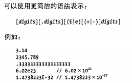

#3 类型 值和变量

+ javascript的数据类型分为原始类型(primitive type)和对象类型(Objective type)

1. 原始类型：数字 字符串 布尔值及特殊的null 和 underfine
2. 对象类型：对象（object）是属性（property）的集合，每个属性都是名/值对构成

+ 普通对象时命名值得无序集合；数组是带编号的值得有序集合

+ 函数是具有与它相关的可执行代码的对象，通过调用函数来运行可执行代码，并返回结果。也是一直特殊的对象，

+ 构造函数都定义了class对象————由构造函数初始化的对象组成的集合。类可以看作为对象类型的子类型。

+ Javascript核心定义特殊类：Array Function Date RegExp Error

+ javascript有自己的内存管理机制，可以自动对内存进行垃圾回收

+ Javascript 是一种面向对象语言

+ 技术上只有javascript对象才能拥有方法，但是数字、字符串和布尔值也可以拥有自己的方法。

+ Javascript只有null和undefined无法拥有方法的值

+ javascript的类型可以分为可变类型和不可变类型：
1. 可变类型：数组和对象
2. 不可变类型：数字 布尔值 null undefined 字符串

+ javascript可以自由进行数据转换

+ Javascript 的变量时无类型的，通过var来声明

3.1 数字
+ javascript的所有数字都是浮点数值来表示
+ javascript的实际操作中基于32为整数
+ 浮点型数字：

