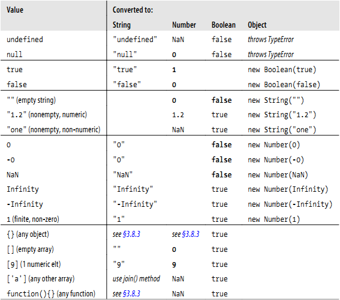

#3 类型 值和变量

+ javascript的数据类型分为原始类型(primitive type)和对象类型(Objective type)

1. 原始类型：数字 字符串 布尔值及特殊的null 和 underfine
2. 对象类型：对象（object）是属性（property）的集合，每个属性都是名/值对构成

+ 普通对象时命名值得无序集合；数组是带编号的值得有序集合

+ 函数是具有与它相关的可执行代码的对象，通过调用函数来运行可执行代码，并返回结果。也是一直特殊的对象，

+ 构造函数都定义了class对象————由构造函数初始化的对象组成的集合。类可以看作为对象类型的子类型。

+ Javascript核心定义特殊类：Array Function Date RegExp Error

+ javascript有自己的内存管理机制，可以自动对内存进行垃圾回收

+ Javascript 是一种面向对象语言

+ 技术上只有javascript对象才能拥有方法，但是数字、字符串和布尔值也可以拥有自己的方法。

+ Javascript只有null和undefined无法拥有方法的值

+ javascript的类型可以分为可变类型和不可变类型：

1. 可变类型：数组和对象
2. 不可变类型：数字 布尔值 null undefined 字符串

+ javascript可以自由进行数据转换

+ Javascript 的变量时无类型的，通过var来声明


##3.1 数字
+ javascript的所有数字都是浮点数值来表示

+ javascript的实际操作中(索引)基于32为整数

+ 浮点型数字：
```
[digits][.digits][(E|e)[(+|-)]digits]
```
```
3.14
2345.789
.333333333333333333
6.02e23        // 6.02 × 1023
```

+ 算数运算符：

1. 基本运算符：+ - * / %
2. 复杂运算符：
```
Math.pow(2,53)           // => 9007199254740992: 2 to the power 53
Math.round(.6)           // => 1.0: round to the nearest integer
Math.ceil(.6)            // => 1.0: round up to an integer
Math.floor(.6)           // => 0.0: round down to an integer
Math.abs(-5)             // => 5: absolute value
Math.max(x,y,z)          // Return the largest argument
Math.min(x,y,z)          // Return the smallest argument
Math.random()            // Pseudo-random number x where 0 <= x < 1.0
Math.PI                  // π: circumference of a circle / diameter
Math.E                   // e: The base of the natural logarithm
Math.sqrt(3)             // The square root of 3
Math.pow(3, 1/3)         // The cube root of 3
Math.sin(0)              // Trigonometry: also Math.cos, Math.atan, etc.
Math.log(10)             // Natural logarithm of 10
Math.log(100)/Math.LN10  // Base 10 logarithm of 100
Math.log(512)/Math.LN2   // Base 2 logarithm of 512
Math.exp(3)              // Math.E cubed
```
javascript 算数运算符在溢出、下溢 或者被0除不会报错。
溢出（overflow）：无穷大（Infinity）或者负无穷大（-Infinity）。
下溢（underflow）: 0 或者 -0
被0除： 返回 Infinity 或者 -Infinity

```
Infinity                    // A read/write variable initialized to Infinity.
Number.POSITIVE_INFINITY    // Same value, read-only.
1/0                         // This is also the same value.
Number.MAX_VALUE + 1        // This also evaluates to Infinity.
Number.NEGATIVE_INFINITY    // These expressions are negative infinity.
-Infinity
-1/0                        
-Number.MAX_VALUE - 1
NaN                         // A read/write variable initialized to NaN.
Number.NaN                  // A read-only property holding the same value.
0/0                         // Evaluates to NaN.
Number.MIN_VALUE/2          // Underflow: evaluates to 0
-Number.MIN_VALUE/2         // Negative zero
-1/Infinity                 // Also negative 0
-0
```
> 判断NaN： x!=x only x=NaN时为true 

> isFinite() 在参数部位NaN、Infinity -Infinity时为true

```
var zero = 0;         // Regular zero
var negz = -0;        // Negative zero
zero === negz         // => true: zero and negative zero are equal 
1/zero === 1/negz     // => false: infinity and -infinity are not equal
```

javascript 的实数是真实值得一个近似表示
```
var x = .3 - .2;    // thirty cents minus 20 cents
var y = .2 - .1;    // twenty cents minus 10 cents
x == y              // => false: the two values are not the same!
x == .1             // => false: .3-.2 is not equal to .1
y == .1             // => true: .2-.1 is equal to .1
```

##3.2 日期与时间
```
var then = new Date(2010, 0, 1);  // The 1st day of the 1st month of 2010
var later = new Date(2010, 0, 1,  // Same day, at 5:10:30pm, local time 17, 10, 30);
var now = new Date();          // The current date and time
var elapsed = now - then;      // Date subtraction: interval in milliseconds 
later.getFullYear()            // => 2010
later.getMonth()               // => 0: zero-based months
later.getDate()                // => 1: one-based days
later.getDay()                 // => 5: day of week.  0 is Sunday 5 is Friday.
later.getHours()               // => 17: 5pm, local time
later.getUTCHours()            // hours in UTC time; depends on timezone
```

##3.3 文本

字符串是一组由16位值组成的不可变有序序列。每个字符通常为Unicode字符

> javascript 定义字符串方法均作用于16位值，而非字符，且不会对代理想进行单独处理，同样Javascript也不会对字符串进行标准化的加工，甚至不能保证字符串是合法的UTF-16位格式

字符串的直接量：
```
""  // The empty string: it has zero characters
'testing'
"3.14"
'name="myform"'
"Wouldn't you prefer O'Reilly's book?"
"This string\nhas two lines"
"π is the ratio of a circle's circumference to its diameter"
"two\nlines"   // A string representing 2 lines written on one line
"one\          // A one-line string written on 3 lines. ECMAScript 5 only.
 long\
 line"
```

+ 转义字符

| 转义字符       | 含义           |
| ------------- |:-------------:| 
| \0    | NULL字符（\u0000） | 
| \b    | 退格符（\u0008）      |   
| \t    | 水平制表符（\u0009）      | 
| \n    | 换行符（ \u000A）|
| \v    | 垂直制表符（\u000B） | 
| \f    | 转页符（\u000C）      |   
| \r    | 回车符（\u000D）      | 
| \"    | 双引号（ \u0022）|
| \'    | 单引号（ \u0027）|
| \\    | 反斜杠（\u005C） | 
| \xXX  | The Latin-1 character specified by the two hexadecimal digits XX      |   
| \uXXXX| The Unicode character specified by the four hexadecimal digits XXXX     | 


+ 字符串的使用：
```
msg = "Hello, " + "world";   // Produces the string "Hello, world"
greeting = "Welcome to my blog," + " " + name;
```

```
var s = "hello, world"        // Start with some text.
s.charAt(0)                   // => "h": the first character.
s.charAt(s.length-1)          // => "d": the last character.
s.substring(1,4)              // => "ell": the 2nd, 3rd and 4th characters.
s.slice(1,4)                  // => "ell": same thing
s.slice(-3)                   // => "rld": last 3 characters
s.indexOf("l")                // => 2: position of first letter l.
s.lastIndexOf("l")            // => 10: position of last letter l.
s.indexOf("l", 3)             // => 3: position of first "l" at or after 3
s.split(", ")                 // => ["hello", "world"] split into substrings
s.replace("h", "H")           // => "Hello, world": replaces all instances
s.toUpperCase()               // => "HELLO, WORLD"
```

ECMAScript 5中字符串可以作为只读数组
```
s = "hello, world";
s[0]                  // => "h"
s[s.length-1]         // => "d"
```

##3.4 正则表达式
javascript定义了RegExp()构造函数，用来创建正则表达式，采用Perl中的语法。
String和RegExp对象都定义了利用正则表达式来匹配和查找、替换的函数
定义：
```
/^HTML/              // Match the letters H T M L at the start of a string
/[1-9][0-9]*/        // Match a non-zero digit, followed by any # of digits
/\bjavascript\b/i    // Match "javascript" as a word, case-insensitive
```
使用：
```
var text = "testing: 1, 2, 3";   // Sample text
var pattern = /\d+/g             // Matches all instances of one or more digits
pattern.test(text)               // => true: a match exists
text.search(pattern)             // => 9: position of first match
text.match(pattern)              // => ["1", "2", "3"]: array of all matches
text.replace(pattern, "#");      // => "testing: #, #, #"
text.split(/\D+/);               // => ["","1","2","3"]: split on non-digits
```

##3.5 Boolean
Boolean只有 true 和 false

以下值会被转换为false：
```
undefined
null
0
-0
NaN
""  // the empty string
```
逻辑运算符： && 、 || 、 ！
```
if ((x == 0 && y == 0) || !(z == 0)) {
    // x and y are both zero or z is non-zero 
}
```

##3.6 null and undefined

|------:|------:|------:|
|null   | 是关键字  |表示空值，是一种特殊的对象  |
|undefined  |不是关键字 | 表示变量没有初始化，或者元素不存在  |

##3.7 全局对象 global object

Javascript启动时创建全局对象并第一初始属性：
+ 全局属性，比如undefined Infinity 和 NaN
+ 全局函数 ， isNaN(), parseInt() , and eval()
+ 构造方法， Date(),  RegExp(),  String(),  Object(), and  Array()
+ 全局对象，  Math and JSON

客户端中，window充当全局对象

##3.8 包装对象

Javascript对象时一种复合值：它是属性或已命名值得集合。通过 `.` 来访问属性值

**为什么字符串也具有方法和属性？**
```
var s = "hello world!";                             // A string
var word = s.substring(s.indexOf(" ")+1, s.length); // Use string properties
```
只要引用了字符串的属性，Javascript回将字符串通过调用`new String(s)`的方式转换成对象。这个对象继承了字符串的方法。并被用来处理对象属性的引用。一旦属性引用借宿，新创建的对象就会销毁。

数字和Boolean也有各自的方式：通过 `Number()` 和 `Boolean()` 构造函数来创建临时对象。
null 和 undefined 没有包装对象：访问他们的属性会造成错误。

+ 在取字符串、数字和Boolean的属性时创建的临时对象称为包装对象。
```
var s = "test", n = 1, b = true;  // A string, number, and boolean value.
var S = new String(s);            // A String object
var N = new Number(n);            // A Number object
var B = new Boolean(b);           // A Boolean object

S       // =>String {0: "t", 1: "e", 2: "s", 3: "t", length: 4, encodeHTML: function, [[PrimitiveValue]]: "test"}
B       // => Boolean {[[PrimitiveValue]]: true}
N       // => Number {[[PrimitiveValue]]: 1}
```

##3.9 不可变值 与 可变的对象引用
+ Javascript的原始值

（undefined null Boolean number String） 是不可更改的，任何方法都无法更改。
1. 原始值的比较是值的比较：只有值相等，才相等。
2. 字符串的比较： 长度相等且每个索引的字符也相等

+ 对象

1. 对象是可变的，他们的值可以修改。
```
var o = { x:1 };     // Start with an object
o.x = 2;             // Mutate it by changing the value of a property
o.y = 3;             // Mutate it again by adding a new property
var a = [1,2,3]      // Arrays are also mutable
a[0] = 0;            // Change the value of an array element
a[3] = 4;            // Add a new array element
```
2. 对象的比较: 即使两个对象包含相同的属性和相同的值，他们也不相等。各个索引元素完全相等的2个数组也不相等。

对象被称为引用类型。对象的比较是引用的比较：当且仅当他们引用同一基对象时，他们才想等。
```
var a = [];   // The variable a refers to an empty array.
var b = a;    // Now b refers to the same array.
b[0] = 1;     // Mutate the array referred to by variable b.
a[0]          // => 1: the change is also visible through variable a.
a === b       // => true: a and b refer to the same object, so they are equal.
```

数组的复制：
```
var a = ['a','b','c'];              // An array we want to copy
var b = [];                         // A distinct array we'll copy into
for(var i = 0; i < a.length; i++) { // For each index of a[]
    b[i] = a[i];                    // Copy an element of a into b
}
```

数组的比较：
```
function equalArrays(a,b) {
    if (a.length != b.length) return false; // Different-size arrays not equal
    for(var i = 0; i < a.length; i++)       // Loop through all elements
        if (a[i] !== b[i]) return false;    // If any differ, arrays not equal
    return true;                            // Otherwise they are equal
}
```

## 3.10 类型转换 

```
10 + " objects"     // => "10 objects".  Number 10 converts to a string
"7" * "4"           // => 28: both strings convert to numbers
var n = 1 - "x";    // => NaN: string "x" can't convert to a number
n + " objects"      // => "NaN objects": NaN converts to string "NaN"
```

javascript 类型转换：


+ 转换与相等性：
一个值转换为领一个值，并不意味着两个值相等。
```
null == undefined // These two values are treated as equal.
"0" == 0          // String converts to a number before comparing.
0 == false        // Boolean converts to number before comparing.
"0" == false      // Both operands convert to numbers before comparing.
```

+ 显示类型转换
```
Number("3")           // => 3
String(false)         // => "false"  Or use false.toString()
Boolean([])           // => true
Object(3)             // => new Number(3)
```
运算符的隐式转换：
```
x + ""           // Same as String(x)
+x               // Same as Number(x).  You may also see x-0
!!x              // Same as Boolean(x). Note double !
```

Number类的进制转换：
```
var n = 17;
binary_string = n.toString(2);        // Evaluates to "10001"
octal_string = "0" + n.toString(8);   // Evaluates to "021"
hex_string = "0x" + n.toString(16);   // Evaluates to "0x11"
```

科学数据处理：
```
var n = 123456.789;
n.toFixed(0);         // "123457"
n.toFixed(2);         // "123456.79"
n.toFixed(5);         // "123456.78900"
n.toExponential(1);   // "1.2e+5"
n.toExponential(3);   // "1.235e+5"
n.toPrecision(4);     // "1.235e+5"
n.toPrecision(7);     // "123456.8"
n.toPrecision(10);    // "123456.7890"
```

字符串转换为数字：parseInt() 或 parseFloat()
```
parseInt("3 blind mice")     // => 3
parseFloat(" 3.14 meters")   // => 3.14
parseInt("-12.34")           // => -12
parseInt("0xFF")             // => 255
parseInt("0xff")             // => 255
parseInt("-0XFF")            // => -255
parseFloat(".1")             // => 0.1
parseInt("0.1")              // => 0
parseInt(".1")               // => NaN: integers can't start with "."
parseFloat("$72.47");        // => NaN: numbers can't start with "$"
```

字符串转换成数字（2进制）:parseInt("Str",2)
```
parseInt("11", 2);           // => 3 (1*2 + 1)
parseInt("ff", 16);          // => 255 (15*16 + 15)
parseInt("zz", 36);          // => 1295 (35*36 + 35)
parseInt("077", 8);          // => 63 (7*8 + 7)
parseInt("077", 10);         // => 77 (7*10 + 7)
```

+ 对象转换成原始值：
1.  对象转boolean 类型：

所有的对象（数组和函数）都转换成true，包括包装对象： `new Boolean(false)` 是一个对象而不是原始值，也是true.
 
2. 对象转字符串：
所有对象都继承了2个转换方法： toString() 和 valueof()
```
({x:1, y:2}).toString()    // => "[object Object]"
```
数组、函数  正则 日期：
```
[1,2,3].toString()                  // => "1,2,3"
(function(x) { f(x); }).toString()  // => "function(x) {\n    f(x);\n}"
/\d+/g.toString()                   // => "/\\d+/g"
new Date(2010,0,1).toString()  // => "Fri Jan 01 2010 00:00:00 GMT-0800 (PST)"
```
valueof():存在原始值，返回原始值，否则返回自身
```
var d = new Date(2010, 0, 1);   // January 1st, 2010, (Pacific time)
d.valueOf()                     // => 1262332800000
```
+ 对象转换成字符串的步骤：

1. 如果对象具有`toString()` 方法，则调用这个方法。如果它返回一个原始值，Javascript将这个值转换为字符串，并返回字符串的结果。
2. 如果没有`toString()` 方法，或者方法不返回一个原始值，则会调用 `valueof()` 方法。如果存在这个方法，则调用它。返回原始值，Javascript将这个值转换为字符串，并返回字符串的结果。
3. 否则，javaScript无法从toString（） 或者valueof()获得一个原始值，因此跑出一个类型错误异常

+ 对象返回数字的过程：

1. 如果此对象具有valueof()方法，后者返回一个原始值，则javaScript将这个原始值转换成数字，并返回数字。
2. 否则，如果对象具有toString() 方法，后者返回一个原始值，则javaScript将其转换并返回。
3. 否则，javaScript抛出一个类型错误异常。

为什么空数组会转换成数字0而为什么具有单个元素的数组同样会转换成一个数字？

> 数组继承了默认的valueof() 方法，这个方法返回一个对象而不是一个原始值。因此数组到数字的转换调用toString() 方法。空数组转换成空字符串，转成0。一个元素的数组会转换成字符串并转换成数字。如果一个数组只包含一个数字的元素也会转换成字符串在转换成数字。
 
`+`, `==` 的操作数有一个是对象，则会先将对象转换成原始值。 
` + `,` == ` 的一个操作数是日起对象时，通过valueof() 或 toString() 返回的原始值会被直接使用。 `-`,`==`,`>`,`<`也是类似。

```
var now = new Date();     // Create a Date object
typeof (now + 1)          // => "string": + converts dates to strings
typeof (now - 1)          // => "number": - uses object-to-number conversion
now == now.toString()     // => true: implicit and explicit string conversions
now > (now -1)            // => true: > converts a Date to a number
```

##3.11 变量声明

```
var i;
var sum;

var i, sum;

var message = "hello";
var i = 0, j = 0, k = 0;
```

##3.12 变量的作用域

全局变量拥有全局作用域。局部变量的作用域是局部的。函数参数的作用域在函数内定义。
```
var scope = "global";         // Declare a global variable
function checkscope() {
    var scope = "local";      // Declare a local variable with the same name
    return scope;             // Return the local value, not the global one
}
checkscope()                  // => "local"
```

```
scope = "global";            // Declare a global variable, even without var.
function checkscope2() {
    scope = "local";         // Oops! We just changed the global variable.
    myscope = "local";       // This implicitly declares a new global variable
    return [scope, myscope]; // Return two values.
}
checkscope2()                // => ["local", "local"]: has side effects!
scope                        // => "local": global variable has changed.
myscope                      // => Uncaught ReferenceError: myscope is not defined
```

```
var scope = "global scope";          // A global variable
function checkscope() {
    var scope = "local scope";       // A local variable
    function nested() {
        var scope = "nested scope";  // A nested scope of local variables
        return scope;                // Return the value in scope here
    }
    return nested();
}
checkscope()                         // => "nested scope"
```
函数作用域 与 声明提前
```
function test(o) {
    var i = 0;                      // i is defined throughout function
    if (typeof o == "object") {
        var j = 0;                  // j is defined everywhere, not just block
        for(var k=0; k < 10; k++) { // k is defined everywhere, not just loop
            console.log(k);         // print numbers 0 through 9
        }
        console.log(k);             // k is still defined: prints 10
    }
    console.log(j);                 // j is defined, but may not be initialized
}
```

```
var scope = "global";
function f() {
    console.log(scope);  // Prints "undefined", not "global"
    var scope = "local"; // Variable initialized here, but defined everywhere
    console.log(scope);  // Prints "local"
}
```

```
function f() {
    var scope;          // Local variable is declared at the top of the function
    console.log(scope); // It exists here, but still has "undefined" value
    scope = "local";    // Now we initialize it and give it a value
    console.log(scope); // And here it has the value we expect
}
```

作为属性的变量

```
var truevar = 1;     // A properly declared global variable, nondeletable.
fakevar = 2;         // Creates a deletable property of the global object.
this.fakevar2 = 3;   // This does the same thing.
delete truevar       // => false: variable not deleted
delete fakevar       // => true: variable deleted
delete this.fakevar2 // => true: variable deleted
```

作用域链：
javaScript是基于词法作用域的语言。