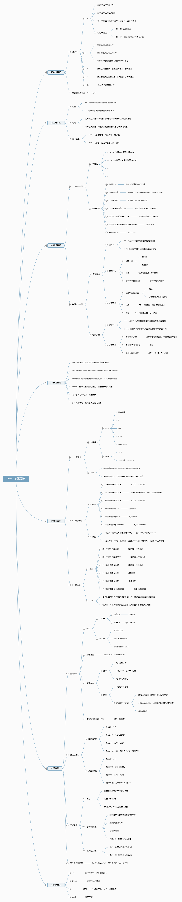

# 4. 表达式与运算符

##4.1 原始表达式
原始表达式包括：常量、直接量、关键字、变量。
```
1.23         // A number literal
"hello"      // A string literal
/pattern/    // A regular expression literal

true      // Evalutes to the boolean true value
false     // Evaluates to the boolean false value
null      // Evaluates to the null value
this      // Evaluates to the "current" object

i             // Evaluates to the value of the variable i.
sum           // Evaluates to the value of the variable sum.
undefined     // undefined is a global variable, not a keyword like null.
```

##4.2 对象和数组的初始化表达式

数组：
```
[]         // An empty array: no expressions inside brackets means no elements
[1+2,3+4]  // A 2-element array.  First element is 3, second is 7

var matrix = [[1,2,3], [4,5,6], [7,8,9]];

var sparseArray = [1,,,,5];
```

对象：
```
var p = { x:2.3, y:-1.2 };  // An object with 2 properties
var q = {};                 // An empty object with no properties
q.x = 2.3; q.y = -1.2;      // Now q has the same properties as p

var rectangle = { 
    upperLeft:  { x: 2, y: 2 },
    lowerRight: { x: 4, y: 5 } 
};
                  
var side = 1;
var square = { 
    "upperLeft":  { x: p.x, y: p.y },
    'lowerRight': { 
        x: p.x + side, 
        y: p.y + side
        }
};
```
    
##4.3 函数的定义表达式
```
// This function returns the square of the value passed to it.
var square = function(x) { return x * x; }
```

##4.4 属性表达式
```
expression . identifier
expression [ expression ]
```
example:
```
var o = {x:1,y:{z:3}};  // An example object
var a = [o,4,[5,6]];    // An example array that contains the object
o.x                     // => 1: property x of expression o
o.y.z                   // => 3: property z of expression o.y
o["x"]                  // => 1: property x of object o
a[1]                    // => 4: element at index 1 of expression a
a[2]["1"]               // => 6: element at index 1 of expression a[2]
a[0].x                  // => 1: property x of expression a[0]
```

##4.5 调用表达式

```
f(0)            // f is the function expression; 0 is the argument expression.
Math.max(x,y,z) // Math.max is the function; x, y and z are the arguments.
a.sort()        // a.sort is the function; there are no arguments.
```

##4.6 对象的创建表达式
有参数
```
new Object()
new Point(2,3)
```
无参数：
```
new Object
new Date
```

##4.7 运算符


运算符的优先级
运算符的结合型：从右往左

##4.8 算数表达式

+ '+'运算符

1. 如果一个操作数是对象，则对象先转换为原始值：日期对象通过toString()转换，其他对象通过valueof() 转换。由于大多数对象不具有valueof()方法，因此通过toString()方法转换。
2. 在进行对象到原始值的转换后，如果一个操作数是字符串的话，另一个数字也会转换成字符串，进行字符串连接
3. 否则两个操作数都将转换成数字或者NaN,然后进行加法操作

```
1 + 2                        // => 3
"hello" + " " + "there"      // => "hello there"
"1" + "2"                    // => "12"
```

```
1 + 2         // => 3: addition
"1" + "2"     // => "12": concatenation
"1" + 2       // => "12": concatenation after number-to-string
1 + {}        // => "1[object Object]": concatenation after object-to-string
true + true   // => 2: addition after boolean-to-number
2 + null      // => 2: addition after null converts to 0
2 + undefined // => NaN: addition after undefined converts to NaN

1 + 2 + " blind mice";    // => "3 blind mice"
1 + (2 + " blind mice");  // => "12 blind mice"
```

##4.9 关系表达式：
 相等 ==
 不等 !=
 恒等 ===
 赋值 =
 比较： <  >  >= <=
 
+ in 运算符
```
var point = { x:1, y:1 };  // Define an object
"x" in point               // => true: object has property named "x"
"z" in point               // => false: object has no "z" property.
"toString" in point        // => true: object inherits toString method
var data = [7,8,9];        // An array with elements 0, 1, and 2
"0" in data                // => true: array has an element "0"
1 in data                  // => true: numbers are converted to strings
3 in data                  // => false: no element 3
```

+ instanceof 运算符
```
var d = new Date();  // Create a new object with the Date() constructor
d instanceof Date;   // Evaluates to true; d was created with Date()
d instanceof Object; // Evaluates to true; all objects are instances of Object
d instanceof Number; // Evaluates to false; d is not a Number object
var a = [1, 2, 3];   // Create an array with array literal syntax
a instanceof Array;  // Evaluates to true; a is an array
a instanceof Object; // Evaluates to true; all arrays are objects
a instanceof RegExp; // Evaluates to false; arrays are not regular expressions
```

+ 逻辑运算符
```
var o = { x : 1 };
var p = null;
o && o.x     // => 1: o is truthy, so return value of o.x
p && p.x     // => null: p is falsy, so return it and don't evaluate p.x

if (a == b) stop();   // Invoke stop() only if a == b
(a == b) && stop();   // This does the same thing


// If max_width is defined, use that.  Otherwise look for a value in
// the preferences object.  If that is not defined use a hard-coded constant.
var max = max_width || preferences.max_width || 500;

// Copy the properties of o to p, and return p
function copy(o, p) {
   p = p || {};  // If no object passed for p, use a newly created object.
   // function body goes here
}

// These two equalities hold for any values of p and q
!(p && q) === !p || !q
!(p || q) === !p && !q
```

##4.11 赋值表达式

|Operator |Example| Equivalent|
|-------:|-------:|--------:|
|+=     | a += b    |   a = a + b  |
|-=     | a -= b    |   a = a - b  |
|*=     | a *= b    |   a = a * b  |
| /=    | a /= b    |    a = a / b |
| %=     | a %= b   |   a = a % b   |
| <<=   |  a <<= b  |   a = a << b  |
|   >>= | a>>= b    |    a = a >> b |
|   >>>=  |a >>>= b  |   a = a >>> b    |
|   &=    | a &= b   |   a = a & b  |
|   ^=    |  a ^= b  |   a = a ^ b  |

##4.12 eval()表达式

```
var geval = eval;                 // Using another name does a global eval
var x = "global", y = "global";   // Two global variables
function f() {                    // This function does a local eval
    var x = "local";              // Define a local variable
    eval("x += 'changed';");      // Direct eval sets local variable
    return x;                     // Return changed local variable
}
function g() {                    // This function does a global eval
    var y = "local";              // A local variable
    geval("y += 'changed';");     // Indirect eval sets global variable
    return y;                     // Return unchanged local variable
}
console.log(f(), x); // Local variable changed: prints "localchanged global": 
console.log(g(), y); // Global variable changed: prints "local globalchanged":
```

## 4.13 其他运算符
+ 条件运算符(?:)

```
x > 0 ? x : -x     // The absolute value of x

greeting = "hello " + (username ? username : "there");
```
+ valueof()

|x                      |typeof x   |
| ------:|---------:|
|undefined              |"undefined"    |
|null                   |"object"   |
|true or false          |"boolean"  |
|any number or NaN      |"number"   |
|any string             |"string"   |
|any function           |"function" |
|any nonfunction native |object "object"    |
|any host object        | An implementation-defined string, but not “undefined”, “boolean”, “number”, or “string”.  |

运算符总结：[svg版本](../images/operator.svg)


