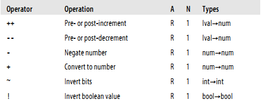
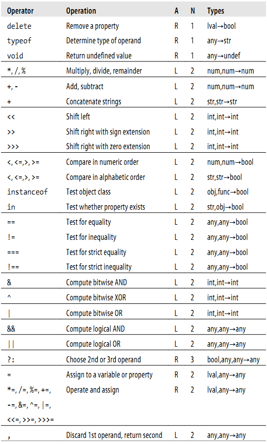

# 4. 表达式与运算符

##4.1 原始表达式
原始表达式包括：常量、直接量、关键字、变量。
```
1.23         // A number literal
"hello"      // A string literal
/pattern/    // A regular expression literal

true      // Evalutes to the boolean true value
false     // Evaluates to the boolean false value
null      // Evaluates to the null value
this      // Evaluates to the "current" object

i             // Evaluates to the value of the variable i.
sum           // Evaluates to the value of the variable sum.
undefined     // undefined is a global variable, not a keyword like null.
```

##4.2 对象和数组的初始化表达式

数组：
```
[]         // An empty array: no expressions inside brackets means no elements
[1+2,3+4]  // A 2-element array.  First element is 3, second is 7

var matrix = [[1,2,3], [4,5,6], [7,8,9]];

var sparseArray = [1,,,,5];
```

对象：
```
var p = { x:2.3, y:-1.2 };  // An object with 2 properties
var q = {};                 // An empty object with no properties
q.x = 2.3; q.y = -1.2;      // Now q has the same properties as p

var rectangle = { 
    upperLeft:  { x: 2, y: 2 },
    lowerRight: { x: 4, y: 5 } 
};
                  
var side = 1;
var square = { 
    "upperLeft":  { x: p.x, y: p.y },
    'lowerRight': { 
        x: p.x + side, 
        y: p.y + side
        }
};
```
    
##4.3 函数的定义表达式
```
// This function returns the square of the value passed to it.
var square = function(x) { return x * x; }
```

##4.5 属性表达式
```
expression . identifier
expression [ expression ]
```
example:
```
var o = {x:1,y:{z:3}};  // An example object
var a = [o,4,[5,6]];    // An example array that contains the object
o.x                     // => 1: property x of expression o
o.y.z                   // => 3: property z of expression o.y
o["x"]                  // => 1: property x of object o
a[1]                    // => 4: element at index 1 of expression a
a[2]["1"]               // => 6: element at index 1 of expression a[2]
a[0].x                  // => 1: property x of expression a[0]
```

##4.5 调用表达式

```
f(0)            // f is the function expression; 0 is the argument expression.
Math.max(x,y,z) // Math.max is the function; x, y and z are the arguments.
a.sort()        // a.sort is the function; there are no arguments.
```

##4.6 对象的创建表达式
有参数
```
new Object()
new Point(2,3)
```
无参数：
```
new Object
new Date
```

##4.7 运算符



运算符的优先级
运算符的结合型：从右往左

##4.8 算数表达式

+ '+'运算符

1. 如果一个操作数是对象，则对象先转换为原始值：日期对象通过toString()转换，其他对象通过valueof() 转换。由于大多数对象不具有valueof()方法，因此通过toString()方法转换。
2. 在进行对象到原始值的转换后，如果一个操作数是字符串的话，另一个数字也会转换成字符串，进行字符串连接
3. 否则两个操作数都将转换成数字或者NaN,然后进行加法操作

```
1 + 2                        // => 3
"hello" + " " + "there"      // => "hello there"
"1" + "2"                    // => "12"
```

```
1 + 2         // => 3: addition
"1" + "2"     // => "12": concatenation
"1" + 2       // => "12": concatenation after number-to-string
1 + {}        // => "1[object Object]": concatenation after object-to-string
true + true   // => 2: addition after boolean-to-number
2 + null      // => 2: addition after null converts to 0
2 + undefined // => NaN: addition after undefined converts to NaN

1 + 2 + " blind mice";    // => "3 blind mice"
1 + (2 + " blind mice");  // => "12 blind mice"
```