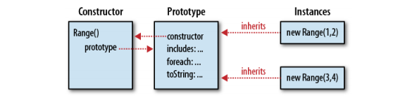

# 9 模块和类

javaScript中的类的实现是基于原型继承机制。如果两个实例都是从同一对象继承了属性，则他们是同一个类的实例。

Javascript类的特性：动态可继承

定义类是模块开发和重用代码的有效方式之一。

## 9.1 类和原型

Javascript中，类的所有对象都是从同一个原型对象上继承属性。因此，原型对象是类的核心。

工厂函数方式
```
// range.js: A class representing a range of values.  
// This is a factory function that returns a new range object.
function range(from, to) {
    // Use the inherit() function to create an object that inherits from the
    // prototype object defined below.  The prototype object is stored as
    // a property of this function, and defines the shared methods (behavior)
    // for all range objects.
    var r = inherit(range.methods); 
    // Store the start and end points (state) of this new range object.
    // These are noninherited properties that are unique to this object.
    r.from = from;
    r.to = to;
    // Finally return the new object
    return r;
}
// This prototype object defines methods inherited by all range objects.
range.methods = {
    // Return true if x is in the range, false otherwise
    // This method works for textual and Date ranges as well as numeric.
    includes: function(x) { return this.from <= x && x <= this.to; },
    // Invoke f once for each integer in the range.
    // This method works only for numeric ranges.
    foreach: function(f) {
        for(var x = Math.ceil(this.from); x <= this.to; x++) f(x);
    },
    // Return a string representation of the range
    toString: function() { return "(" + this.from + "..." + this.to + ")"; }
};
// Here are example uses of a range object.
var r = range(1,3);      // Create a range object
r.includes(2);           // => true: 2 is in the range
r.foreach(console.log);  // Prints 1 2 3
console.log(r);          // Prints (1...3)    
```

## 9.2 类和构造函数

构造函数方式：
```
// range2.js: Another class representing a range of values.  
// This is a constructor function that initializes new Range objects.
// Note that it does not create or return the object. It just initializes this.
function Range(from, to) {
    // Store the start and end points (state) of this new range object.
    // These are noninherited properties that are unique to this object.
    this.from = from;
    this.to = to;
}
// All Range objects inherit from this object.
// Note that the property name must be "prototype" for this to work.
Range.prototype = {
    // Return true if x is in the range, false otherwise
    // This method works for textual and Date ranges as well as numeric.
    includes: function(x) { return this.from <= x && x <= this.to; },
    // Invoke f once for each integer in the range.
    // This method works only for numeric ranges.
    foreach: function(f) {
        for(var x = Math.ceil(this.from); x <= this.to; x++) f(x);
    },
    // Return a string representation of the range
    toString: function() { return "(" + this.from + "..." + this.to + ")"; }
};
// Here are example uses of a range object
var r = new Range(1,3);   // Create a range object
r.includes(2);            // => true: 2 is in the range
r.foreach(console.log);   // Prints 1 2 3
console.log(r);           // Prints (1...3)

```

+ 构造函数与类的标识
 原型对象是类的唯一标识。
 
```
r instanceof Range   // returns true if r inherits from Range.prototype
```

+ constructor 属性
constructor 属性 代指类
```
var F = function() {}; // This is a function object. 
var p = F.prototype;   // This is the prototype object associated with it.
var c = p.constructor; // This is the function associated with the prototype.
c === F                // => true: F.prototype.constructor==F for any function
```



修正range2.js中不含所有constuctor属性方式：

显式声明：
```
Range.prototype = {
    constructor: Range,  // Explicitly set the constructor back-reference
    includes: function(x) { return this.from <= x && x <= this.to; },
    foreach: function(f) {
        for(var x = Math.ceil(this.from); x <= this.to; x++) f(x);
    },
    toString: function() { return "(" + this.from + "..." + this.to + ")"; }
};
```
扩展Range.prototype对象
```
// Extend the predefined Range.prototype object so we don't overwrite
// the automatically created Range.prototype.constructor property.
Range.prototype.includes = function(x) { return this.from<=x && x<=this.to; };
Range.prototype.foreach = function(f) {
    for(var x = Math.ceil(this.from); x <= this.to; x++) f(x);
};
Range.prototype.toString = function() {
    return "(" + this.from + "..." + this.to + ")";
};
```

## 9.3 javascript 中java式的类继承

Javascript定义类：
1. 先定义一个构造函数，并设置初始化新对象的实例属性。
2. 给构造函数的prototype对象定义实现实例的方法。
3. 给构造函数定义类字段和类属性。

```
// A simple function for defining simple classes
function defineClass(constructor,  // A function that sets instance properties
                     methods,      // Instance methods: copied to prototype
                     statics)      // Class properties: copied to constructor
{
    if (methods) extend(constructor.prototype, methods);
    if (statics) extend(constructor, statics);
    return constructor;
}
// This is a simple variant of our Range class
var SimpleRange =
    defineClass(function(f,t) { this.f = f; this.t = t; },
                {
                    includes: function(x) { return this.f <= x && x <= this.t;},
                    toString: function() { return this.f + "..." + this.t; }
                },
                { upto: function(t) { return new SimpleRange(0, t); } });
```

complex类：

```
/*
 * Complex.js:
 * This file defines a Complex class to represent complex numbers.
 * Recall that a complex number is the sum of a real number and an
 * imaginary number and that the imaginary number i is the square root of -1.
 */
/*
 * This constructor function defines the instance fields r and i on every
 * instance it creates.  These fields hold the real and imaginary parts of
 * the complex number: they are the state of the object.
 */
function Complex(real, imaginary) {
    if (isNaN(real) || isNaN(imaginary)) // Ensure that both args are numbers.
        throw new TypeError();           // Throw an error if they are not.
    this.r = real;                       // The real part of the complex number.
    this.i = imaginary;                  // The imaginary part of the number.
}
/*
 * The instance methods of a class are defined as function-valued properties
 * of the prototype object.  The methods defined here are inherited by all
 * instances and provide the shared behavior of the class. Note that JavaScript
 * instance methods must use the this keyword to access the instance fields.
 */

// Add a complex number to this one and return the sum in a new object.
Complex.prototype.add = function(that) {
    return new Complex(this.r + that.r, this.i + that.i);
};
// Multiply this complex number by another and return the product.
Complex.prototype.mul = function(that) {
    return new Complex(this.r * that.r - this.i * that.i,
                       this.r * that.i + this.i * that.r);
};
// Return the real magnitude of a complex number. This is defined
// as its distance from the origin (0,0) of the complex plane.
Complex.prototype.mag = function() {
    return Math.sqrt(this.r*this.r + this.i*this.i);
};
// Return a complex number that is the negative of this one.
Complex.prototype.neg = function() { return new Complex(-this.r, -this.i); };
// Convert a Complex object to a string in a useful way.
Complex.prototype.toString = function() {
    return "{" + this.r + "," + this.i + "}";
};
// Test whether this Complex object has the same value as another.
Complex.prototype.equals = function(that) {
    return that != null &&                      // must be defined and non-null
        that.constructor === Complex &&         // and an instance of Complex 
        this.r === that.r && this.i === that.i; // and have the same values.
};
/*
 * Class fields (such as constants) and class methods are defined as 
 * properties of the constructor. Note that class methods do not 
 * generally use the this keyword: they operate only on their arguments.
 */
// Here are some class fields that hold useful predefined complex numbers.
// Their names are uppercase to indicate that they are constants.
// (In ECMAScript 5, we could actually make these properties read-only.)
Complex.ZERO = new Complex(0,0);
Complex.ONE = new Complex(1,0);
Complex.I = new Complex(0,1);
// This class method parses a string in the format returned by the toString
// instance method and returns a Complex object or throws a TypeError.
Complex.parse = function(s) {
    try {          // Assume that the parsing will succeed
        var m = Complex._format.exec(s);  // Regular expression magic
        return new Complex(parseFloat(m[1]), parseFloat(m[2]));
    } catch (x) {  // And throw an exception if it fails
        throw new TypeError("Can't parse '" + s + "' as a complex number.");
    }
};

// A "private" class field used in Complex.parse() above.
// The underscore in its name indicates that it is intended for internal
// use and should not be considered part of the public API of this class.
Complex._format = /^\{([^,]+),([^}]+)\}$/;
```

```
var c = new Complex(2,3);     // Create a new object with the constructor
var d = new Complex(c.i,c.r); // Use instance properties of c
c.add(d).toString();          // => "{5,5}": use instance methods
// A more complex expression that uses a class method and field
Complex.parse(c.toString()).  // Convert c to a string and back again,
    add(c.neg()).             // add its negative to it,
    equals(Complex.ZERO)      // and it will always equal zero
```
 not recommended
```
Complex.prototype.toString = function() {
    with(this) {
        return "{" + r + "," + i + "}";
    }
};
```
## 9.4 类的扩充
Javascript中基于原型的继承机制是动态的：对象从其原型继承属性，如果创建对象之后原型的属性发生改变，也会影响
继承这个原型的所有实例对象。

```
// Return a complex number that is the complex conjugate of this one.
Complex.prototype.conj = function() { return new Complex(this.r, -this.i); };
```

```
// Invoke the function f this many times, passing the iteration number
// For example, to print "hello" 3 times:
//     var n = 3;
//     n.times(function(n) { console.log(n + " hello"); });
Number.prototype.times = function(f, context) {
    var n = Number(this);
    for(var i = 0; i < n; i++) f.call(context, i);
};
// Define the ES5 String.trim() method if one does not already exist.
// This method returns a string with whitespace removed from the start and end.
String.prototype.trim = String.prototype.trim || function() {
    if (!this) return this;                // Don't alter the empty string
    return this.replace(/^\s+|\s+$/g, ""); // Regular expression magic
};
// Return a function's name.  If it has a (nonstandard) name property, use it.
// Otherwise, convert the function to a string and extract the name from that.
// Returns an empty string for unnamed functions like itself.
Function.prototype.getName = function() {
    return this.name || this.toString().match(/function\s*([^(]*)\(/)[1];
};
```

## 9.5 类和类型
构造函数是类的公共标识，但是原型是唯一的标识。

+ instanceof 运算符

instanceof 实际上是检测对象的继承关系，而不是检测创建对象的构造函数。

isPrototypeOf()
```
range.methods.isPrototypeOf(r);  // range.methods is the prototype object.
```
缺点：无法通过对象来获得类名，只能检测对象是否属于指定的类名。

+ constructor 属性

```
function typeAndValue(x) {
    if (x == null) return "";  // Null and undefined don't have constructors
    switch(x.constructor) {
    case Number:  return "Number: " + x;         // Works for primitive types
    case String:  return "String: '" + x + "'";
    case Date:    return "Date: " + x;           // And for built-in types
    case RegExp:  return "Regexp: " + x;
    case Complex: return "Complex: " + x;        // And for user-defined types
    }
}
```

缺点：并非所有的类都有constructor属性。在多个执行上下文的场景中无法正常工作。

+ 构造函数的名称

可以判断值得类型type()函数：
```
/**
 * Return the type of o as a string:
 *   -If o is null, return "null", if o is NaN, return "nan".
 *   -If typeof returns a value other than "object" return that value.
 *    (Note that some implementations identify regexps as functions.)
 *   -If the class of o is anything other than "Object", return that.
 *   -If o has a constructor and that constructor has a name, return it.
 *   -Otherwise, just return "Object".
 **/
function type(o) {
    var t, c, n;  // type, class, name
    // Special case for the null value:
    if (o === null) return "null";
    // Another special case: NaN is the only value not equal to itself:
    if (o !== o) return "nan";
    // Use typeof for any value other than "object".
    // This identifies any primitive value and also functions.
    if ((t = typeof o) !== "object") return t;
    // Return the class of the object unless it is "Object".
    // This will identify most native objects.
    if ((c = classof(o)) !== "Object") return c;
    // Return the object's constructor name, if it has one
    if (o.constructor && typeof o.constructor === "function" &&
        (n = o.constructor.getName())) return n;
    // We can't determine a more specific type, so return "Object"
    return "Object";
}
// Return the class of an object.
function classof(o) {
    return Object.prototype.toString.call(o).slice(8,-1);
};
    
// Return the name of a function (may be "") or null for nonfunctions
Function.prototype.getName = function() {
    if ("name" in this) return this.name;
    return this.name = this.toString().match(/function\s*([^(]*)\(/)[1];
};
```

```
// This constructor has no name
var Complex = function(x,y) { this.r = x; this.i = y; } 
// This constructor does have a name
var Range = function Range(f,t) { this.from = f; this.to = t; }
```

+ 鸭式辨型

```
// Return true if o implements the methods specified by the remaining args.
function quacks(o /*, ... */) {
    for(var i = 1; i < arguments.length; i++) {  // for each argument after o
        var arg = arguments[i];
        switch(typeof arg) { // If arg is a:
        case 'string':       // string: check for a method with that name
            if (typeof o[arg] !== "function") return false;
            continue;
        case 'function':     // function: use the prototype object instead
            // If the argument is a function, we use its prototype object
            arg = arg.prototype;
            // fall through to the next case
        case 'object':       // object: check for matching methods
            for(var m in arg) { // For each property of the object
                if (typeof arg[m] !== "function") continue; // skip non-methods
                if (typeof o[m] !== "function") return false;
            }
        }
    }
    
    // If we're still here, then o implements everything
    return true;
}
```
## 9.6 javascript 面向对象

+ set 集合类

Example 9-6. Set.js: An arbitrary set of values
```
function Set() {          // This is the constructor
    this.values = {};     // The properties of this object hold the set
    this.n = 0;           // How many values are in the set
    this.add.apply(this, arguments);  // All arguments are values to add
}
// Add each of the arguments to the set.
Set.prototype.add = function() {
    for(var i = 0; i < arguments.length; i++) {  // For each argument
        var val = arguments[i];                  // The value to add to the set
        var str = Set._v2s(val);                 // Transform it to a string
        if (!this.values.hasOwnProperty(str)) {  // If not already in the set
            this.values[str] = val;              // Map string to value
            this.n++;                            // Increase set size
        }
    }
    return this;                                 // Support chained method calls
};
// Remove each of the arguments from the set.
Set.prototype.remove = function() {
    for(var i = 0; i < arguments.length; i++) {  // For each argument
        var str = Set._v2s(arguments[i]);        // Map to a string
        if (this.values.hasOwnProperty(str)) {   // If it is in the set
            delete this.values[str];             // Delete it
            this.n--;                            // Decrease set size
        }
    }
    return this;                                 // For method chaining
};
// Return true if the set contains value; false otherwise.
Set.prototype.contains = function(value) {
    return this.values.hasOwnProperty(Set._v2s(value));
};
// Return the size of the set.
Set.prototype.size = function() { return this.n; };
// Call function f on the specified context for each element of the set.
Set.prototype.foreach = function(f, context) {
    for(var s in this.values)                 // For each string in the set
        if (this.values.hasOwnProperty(s))    // Ignore inherited properties
            f.call(context, this.values[s]);  // Call f on the value
};
// This internal function maps any JavaScript value to a unique string.
Set._v2s = function(val) {
    switch(val) {
        case undefined:     return 'u';          // Special primitive
        case null:          return 'n';          // values get single-letter
        case true:          return 't';          // codes.
        case false:         return 'f';
        default: switch(typeof val) {
            case 'number':  return '#' + val;    // Numbers get # prefix.
            case 'string':  return '"' + val;    // Strings get " prefix.
            default: return '@' + objectId(val); // Objs and funcs get @
        }
    }
  // For any object, return a string. This function will return a different
  // string for different objects, and will always return the same string
  // if called multiple times for the same object. To do this it creates a
  // property on o. In ES5 the property would be nonenumerable and read-only.
    function objectId(o) {
        var prop = "|**objectid**|";   // Private property name for storing ids
        if (!o.hasOwnProperty(prop))   // If the object has no id
            o[prop] = Set._v2s.next++; // Assign it the next available
        return o[prop];                // Return the id
    }
};
Set._v2s.next = 100;    // Start assigning object ids at this value.  

```

+ 枚举类型 Enumerated Types

```
// Create a new Coin class with four values: Coin.Penny, Coin.Nickel, etc.
var Coin = enumeration({Penny: 1, Nickel:5, Dime:10, Quarter:25});
var c = Coin.Dime;                   // This is an instance of the new class
c instanceof Coin                    // => true: instanceof works
c.constructor == Coin                // => true: constructor property works
Coin.Quarter + 3*Coin.Nickel         // => 40: values convert to numbers
Coin.Dime == 10                      // => true: more conversion to numbers
Coin.Dime > Coin.Nickel              // => true: relational operators work
String(Coin.Dime) + ":" + Coin.Dime  // => "Dime:10": coerce to string
```
Enumerated types in JavaScript
```
// This function creates a new enumerated type.  The argument object specifies
// the names and values of each instance of the class. The return value
// is a constructor function that identifies the new class.  Note, however
// that the constructor throws an exception: you can't use it to create new
// instances of the type.  The returned constructor has properties that 
// map the name of a value to the value itself, and also a values array,
// a foreach() iterator function
function enumeration(namesToValues) {
    // This is the dummy constructor function that will be the return value.
    var enumeration = function() { throw "Can't Instantiate Enumerations"; };
    // Enumerated values inherit from this object.
    var proto = enumeration.prototype = {
        constructor: enumeration,                   // Identify type
        toString: function() { return this.name; }, // Return name
        valueOf: function() { return this.value; }, // Return value
        toJSON: function() { return this.name; }    // For serialization
    };
    enumeration.values = [];  // An array of the enumerated value objects
    // Now create the instances of this new type.
    for(name in namesToValues) {         // For each value 
        var e = inherit(proto);          // Create an object to represent it
        e.name = name;                   // Give it a name
        e.value = namesToValues[name];   // And a value
        enumeration[name] = e;           // Make it a property of constructor
        enumeration.values.push(e);      // And store in the values array
    }
    // A class method for iterating the instances of the class
    enumeration.foreach = function(f,c) {
        for(var i = 0; i < this.values.length; i++) f.call(c,this.values[i]);
    };
    // Return the constructor that identifies the new type
    return enumeration;
}
```

Representing cards with enumerated types
```
// Define a class to represent a playing card
function Card(suit, rank) {
    this.suit = suit;         // Each card has a suit
    this.rank = rank;         // and a rank
}
// These enumerated types define the suit and rank values
Card.Suit = enumeration({Clubs: 1, Diamonds: 2, Hearts:3, Spades:4});
Card.Rank = enumeration({Two: 2, Three: 3, Four: 4, Five: 5, Six: 6,
                         Seven: 7, Eight: 8, Nine: 9, Ten: 10,
                         Jack: 11, Queen: 12, King: 13, Ace: 14});
// Define a textual representation for a card
Card.prototype.toString = function() {
    return this.rank.toString() + " of " + this.suit.toString();
};
// Compare the value of two cards as you would in poker
Card.prototype.compareTo = function(that) {
    if (this.rank < that.rank) return -1;
    if (this.rank > that.rank) return 1;
    return 0;
};
// A function for ordering cards as you would in poker
Card.orderByRank = function(a,b) { return a.compareTo(b); };
// A function for ordering cards as you would in bridge 
Card.orderBySuit = function(a,b) {
    if (a.suit < b.suit) return -1;
    if (a.suit > b.suit) return 1;
    if (a.rank < b.rank) return -1;
    if (a.rank > b.rank) return  1;
    return 0;
};
// Define a class to represent a standard deck of cards
function Deck() {
    var cards = this.cards = [];     // A deck is just an array of cards
    Card.Suit.foreach(function(s) {  // Initialize the array
                          Card.Rank.foreach(function(r) {
                                                cards.push(new Card(s,r));
                                            });
                      });
}
 
// Shuffle method: shuffles cards in place and returns the deck
Deck.prototype.shuffle = function() { 
    // For each element in the array, swap with a randomly chosen lower element
    var deck = this.cards, len = deck.length;
    for(var i = len-1; i > 0; i--) {
        var r = Math.floor(Math.random()*(i+1)), temp;     // Random number
        temp = deck[i], deck[i] = deck[r], deck[r] = temp; // Swap
    }
    return this;
};

// Deal method: returns an array of cards
Deck.prototype.deal = function(n) {  
    if (this.cards.length < n) throw "Out of cards";
    return this.cards.splice(this.cards.length-n, n);
};
// Create a new deck of cards, shuffle it, and deal a bridge hand
var deck = (new Deck()).shuffle();
var hand = deck.deal(13).sort(Card.orderBySuit);
```

+ 标准转换方法

toString()
toLocalString()
valueOf()
toJSON()

```
// Add these methods to the Set prototype object.
extend(Set.prototype, {
           // Convert a set to a string
           toString: function() {
               var s = "{", i = 0;
               this.foreach(function(v) { s += ((i++ > 0)?", ":"") + v; });
               return s + "}";
           },
           // Like toString, but call toLocaleString on all values
           toLocaleString : function() {
               var s = "{", i = 0;
               this.foreach(function(v) {
                                if (i++ > 0) s += ", ";
                                if (v == null) s += v; // null & undefined
                                else s += v.toLocaleString(); // all others
                            });
               return s + "}";
           },
           // Convert a set to an array of values
           toArray: function() {
               var a = [];
               this.foreach(function(v) { a.push(v); });
               return a;
           }
       });
// Treat sets like arrays for the purposes of JSON stringification.
Set.prototype.toJSON = Set.prototype.toArray;
```

+ 比较方法

```
// The Range class overwrote its constructor property. So add it now.
Range.prototype.constructor = Range;
// A Range is not equal to any nonrange.  
// Two ranges are equal if and only if their endpoints are equal.
Range.prototype.equals = function(that) {
    if (that == null) return false;               // Reject null and undefined
    if (that.constructor !== Range) return false; // Reject non-ranges
    // Now return true if and only if the two endpoints are equal.
    return this.from == that.from && this.to == that.to;
}
```
Set
```
Set.prototype.equals = function(that) {
    // Shortcut for trivial case
    if (this === that) return true;  
    // If the that object is not a set, it is not equal to this one.
    // We use instanceof to allow any subclass of Set.
    // We could relax this test if we wanted true duck-typing.
    // Or we could strengthen it to check this.constructor == that.constructor
    // Note that instanceof properly rejects null and undefined values
    if (!(that instanceof Set)) return false;
    // If two sets don't have the same size, they're not equal
    if (this.size() != that.size()) return false;
    // Now check whether every element in this is also in that.
    // Use an exception to break out of the foreach if the sets are not equal.
    try {
        this.foreach(function(v) { if (!that.contains(v)) throw false; });
        return true;                    // All elements matched: sets are equal.
    } catch (x) {
        if (x === false) return false;  // An element in this is not in that.
        throw x;                        // Some other exception: rethrow it.
    }
};
```

```
Range.prototype.compareTo = function(that) {
    return this.from - that.from;
};

// Order ranges by lower bound, or upper bound if the lower bounds are equal.
// Throws an error if passed a non-Range value.
// Returns 0 if and only if this.equals(that).
Range.prototype.compareTo = function(that) {
    if (!(that instanceof Range))
        throw new Error("Can't compare a Range with " + that);
    var diff = this.from - that.from;         // Compare lower bounds
    if (diff == 0) diff = this.to - that.to;  // If equal, compare upper bounds
    return diff;
};
```
```
ranges.sort(function(a,b) { return a.compareTo(b); });
```
```
Range.byLowerBound = function(a,b) { return a.compareTo(b); };
```
```
ranges.sort(Range.byLowerBound);
```

+ 方法借用

 Generic methods for borrowing
 
```
var generic = {
    // Returns a string that includes the name of the constructor function
    // if available and the names and values of all noninherited, nonfunction
    // properties.
    toString: function() {
        var s = '[';
        // If the object has a constructor and the constructor has a name,
        // use that class name as part of the returned string.  Note that
        // the name property of functions is nonstandard and not supported
        // everywhere.
        if (this.constructor && this.constructor.name)
            s += this.constructor.name + ": ";
        // Now enumerate all noninherited, nonfunction properties
        var n = 0;
        for(var name in this) {
            if (!this.hasOwnProperty(name)) continue;   // skip inherited props
            var value = this[name];
            if (typeof value === "function") continue;  // skip methods
            if (n++) s += ", ";
            s += name + '=' + value;
        }
        return s + ']';
    },
    // Tests for equality by comparing the constructors and instance properties
    // of this and that.  Only works for classes whose instance properties are
    // primitive values that can be compared with ===.
    // As a special case, ignore the special property added by the Set class.
    equals: function(that) {
        if (that == null) return false;
        if (this.constructor !== that.constructor) return false;
        for(var name in this) {
            if (name === "|**objectid**|") continue;     // skip special prop.
            if (!this.hasOwnProperty(name)) continue;    // skip inherited 
            if (this[name] !== that[name]) return false; // compare values
        }
        return true;  // If all properties matched, objects are equal.
    }
};
```

+ 私有状态

A Range class with weakly encapsulated endpoints
```
function Range(from, to) {
    // Don't store the endpoints as properties of this object. Instead
    // define accessor functions that return the endpoint values.
    // These values are stored in the closure.
    this.from = function() { return from; };
    this.to = function() { return to; };
}
// The methods on the prototype can't see the endpoints directly: they have
// to invoke the accessor methods just like everyone else.
Range.prototype = {
    constructor: Range,
    includes: function(x) { return this.from() <= x && x <= this.to(); },
    foreach: function(f) {
        for(var x=Math.ceil(this.from()), max=this.to(); x <= max; x++) f(x);
    },
    toString: function() { return "(" + this.from() + "..." + this.to() + ")"; }
};

```

+ 构造函数的重载和工厂方法

```
function Set() {          
    this.values = {};     // The properties of this object hold the set
    this.n = 0;           // How many values are in the set
    // If passed a single array-like object, add its elements to the set
    // Otherwise, add all arguments to the set
    if (arguments.length == 1 && isArrayLike(arguments[0])) 
        this.add.apply(this, arguments[0]);
    else if (arguments.length > 0)
        this.add.apply(this, arguments);
}
```

工厂方法
```
Complex.polar = function(r, theta) {
    return new Complex(r*Math.cos(theta), r*Math.sin(theta));
};
```
```
Set.fromArray = function(a) {
    s = new Set();      // Create a new empty set
    s.add.apply(s, a);  // Pass elements of array a to the add method
    return s;           // Return the new set
};
```

```
// An auxiliary constructor for the Set class.
function SetFromArray(a) {
    // Initialize new object by invoking Set() as a function, 
    // passing the elements of a as individual arguments.
    Set.apply(this, a); 
}
// Set the prototype so that SetFromArray creates instances of Set
SetFromArray.prototype = Set.prototype;
var s = new SetFromArray([1,2,3]);
s instanceof Set   // => true
```

## 9.7 子类

+ 定义子类

```
B.prototype = inherit(A.prototype); // Subclass inherits from superclass
B.prototype.constructor = B;        // Override the inherited constructor prop.
```
Subclass definition utilities
```
Example 9-11. Subclass definition utilities
// A simple function for creating simple subclasses
function defineSubclass(superclass,  // Constructor of the superclass
                        constructor, // The constructor for the new subclass
                        methods,     // Instance methods: copied to prototype
                        statics)     // Class properties: copied to constructor
{
    // Set up the prototype object of the subclass
    constructor.prototype = inherit(superclass.prototype);
    constructor.prototype.constructor = constructor;
    // Copy the methods and statics as we would for a regular class
    if (methods) extend(constructor.prototype, methods);
    if (statics) extend(constructor, statics);
    // Return the class
    return constructor;
}
// We can also do this as a method of the superclass constructor
Function.prototype.extend = function(constructor, methods, statics) {
    return defineSubclass(this, constructor, methods, statics);
};
```

SingleSet
```
// The constructor function 
function SingletonSet(member) {
    this.member = member;   // Remember the single member of the set
}
// Create a prototype object that inherits from the prototype of Set.
SingletonSet.prototype = inherit(Set.prototype);
// Now add properties to the prototype.
// These properties override the properties of the same name from Set.prototype.
extend(SingletonSet.prototype, {
           // Set the constructor property appropriately
           constructor: SingletonSet,
           // This set is read-only: add() and remove() throw errors
           add: function() { throw "read-only set"; },    
           remove: function() { throw "read-only set"; }, 
           // A SingletonSet always has size 1
           size: function() { return 1; },                
           // Just invoke the function once, passing the single member.
           foreach: function(f, context) { f.call(context, this.member); },
           // The contains() method is simple: true only for one value
           contains: function(x) { return x === this.member; }
       });
```

```
SingletonSet.prototype.equals = function(that) {
    return that instanceof Set && that.size()==1 && that.contains(this.member);
};
```

+ 构造函数与方法链

子类调用父类的构造函数与方法：
```
/*
 * NonNullSet is a subclass of Set that does not allow null and undefined
 * as members of the set.
 */
function NonNullSet() {
    // Just chain to our superclass.
    // Invoke the superclass constructor as an ordinary function to initialize
    // the object that has been created by this constructor invocation.
    Set.apply(this, arguments);
}
// Make NonNullSet a subclass of Set:
NonNullSet.prototype = inherit(Set.prototype);
NonNullSet.prototype.constructor = NonNullSet;
// To exclude null and undefined, we only have to override the add() method
NonNullSet.prototype.add = function() {
    // Check for null or undefined arguments
    for(var i = 0; i < arguments.length; i++)
        if (arguments[i] == null)
            throw new Error("Can't add null or undefined to a NonNullSet");
    // Chain to the superclass to perform the actual insertion
    return Set.prototype.add.apply(this, arguments);
};
```

```
// Define a set class that holds strings only
var StringSet = filteredSetSubclass(Set,
                                    function(x) {return typeof x==="string";});
// Define a set class that does not allow null, undefined or functions
var MySet = filteredSetSubclass(NonNullSet,
                                function(x) {return typeof x !== "function";});
```
 A class factory and method chaining
```
/*
 * This function returns a subclass of specified Set class and overrides 
 * the add() method of that class to apply the specified filter.
 */
function filteredSetSubclass(superclass, filter) {
    var constructor = function() {          // The subclass constructor
        superclass.apply(this, arguments);  // Chains to the superclass
    };
    var proto = constructor.prototype = inherit(superclass.prototype);
    proto.constructor = constructor;
    proto.add = function() {
        // Apply the filter to all arguments before adding any
        for(var i = 0; i < arguments.length; i++) {
            var v = arguments[i];
            if (!filter(v)) throw("value " + v + " rejected by filter");
        }
        // Chain to our superclass add implementation
        superclass.prototype.add.apply(this, arguments);
    };
    return constructor;
}
```
```
var NonNullSet = (function() {  // Define and invoke function
    var superclass = Set;       // Only specify the superclass once.
    return superclass.extend(
        function() { superclass.apply(this, arguments); },  // the constructor
        {                                                   // the methods
            add: function() {
                // Check for null or undefined arguments
                for(var i = 0; i < arguments.length; i++)
                    if (arguments[i] == null)
                        throw new Error("Can't add null or undefined");
                // Chain to the superclass to perform the actual insertion
                return superclass.prototype.add.apply(this, arguments);
            }
        });
}());            
```
+ 组合 VS 子类

使用组合代替继承的集合的实现
```
/*
 * A FilteredSet wraps a specified set object and applies a specified filter
 * to values passed to its add() method.  All of the other core set methods 
 * simply forward to the wrapped set instance.
 */
var FilteredSet = Set.extend(
    function FilteredSet(set, filter) {  // The constructor
        this.set = set;
        this.filter = filter;
    }, 
    {  // The instance methods
        add: function() {
            // If we have a filter, apply it
            if (this.filter) {
                for(var i = 0; i < arguments.length; i++) {
                    var v = arguments[i];
                    if (!this.filter(v))
                        throw new Error("FilteredSet: value " + v +
                                        " rejected by filter");
                }
            }
            // Now forward the add() method to this.set.add()
            this.set.add.apply(this.set, arguments);
            return this;
        },
        // The rest of the methods just forward to this.set and do nothing else.
        remove: function() {
            this.set.remove.apply(this.set, arguments);
            return this;
        },
        contains: function(v) { return this.set.contains(v); },
        size: function() { return this.set.size(); },
        foreach: function(f,c) { this.set.foreach(f,c); }
    });        
```

```
var s = new FilteredSet(new Set(), function(x) { return x !== null; });

var t = new FilteredSet(s, { function(x} { return !(x instanceof Set); });
```

+ 类的层次结构和抽象类

抽象类和非抽象类Set类的层次结构
```
// A convenient function that can be used for any abstract method
function abstractmethod() { throw new Error("abstract method"); }
/*
 * The AbstractSet class defines a single abstract method, contains().
 */
function AbstractSet() { throw new Error("Can't instantiate abstract classes");}
AbstractSet.prototype.contains = abstractmethod;
/*
 * NotSet is a concrete subclass of AbstractSet.
 * The members of this set are all values that are not members of some
 * other set. Because it is defined in terms of another set it is not
 * writable, and because it has infinite members, it is not enumerable.
 * All we can do with it is test for membership.
 * Note that we're using the Function.prototype.extend() method we defined
 * earlier to define this subclass.
 */
var NotSet = AbstractSet.extend(
    function NotSet(set) { this.set = set; },
    {
        contains: function(x) { return !this.set.contains(x); },
        toString: function(x) { return "~" + this.set.toString(); },
        equals: function(that) {
            return that instanceof NotSet && this.set.equals(that.set);
        }
    }
);

/*
 * AbstractEnumerableSet is an abstract subclass of AbstractSet.
 * It defines the abstract methods size() and foreach(), and then implements
 * concrete isEmpty(), toArray(), to[Locale]String(), and equals() methods
 * on top of those. Subclasses that implement contains(), size(), and foreach() 
 * get these five concrete methods for free.
 */
var AbstractEnumerableSet = AbstractSet.extend(
    function() { throw new Error("Can't instantiate abstract classes"); }, 
    {
        size: abstractmethod,
        foreach: abstractmethod,
        isEmpty: function() { return this.size() == 0; },
        toString: function() {
            var s = "{", i = 0;
            this.foreach(function(v) {
                             if (i++ > 0) s += ", ";
                             s += v;
                         });
            return s + "}";
        },
        toLocaleString : function() {
            var s = "{", i = 0;
            this.foreach(function(v) {
                             if (i++ > 0) s += ", ";
                             if (v == null) s += v; // null & undefined
                             else s += v.toLocaleString(); // all others
                         });
            return s + "}";
        },
        toArray: function() {
            var a = [];
            this.foreach(function(v) { a.push(v); });
            return a;
        },
        equals: function(that) {
            if (!(that instanceof AbstractEnumerableSet)) return false;
            // If they don't have the same size, they're not equal
            if (this.size() != that.size()) return false;
            // Now check whether every element in this is also in that.
            try {
                this.foreach(function(v) {if (!that.contains(v)) throw false;});
                return true;  // All elements matched: sets are equal.
            } catch (x) {
                if (x === false) return false; // Sets are not equal
                throw x; // Some other exception occurred: rethrow it.
            }
        }
    });

/*
 * SingletonSet is a concrete subclass of AbstractEnumerableSet.
 * A singleton set is a read-only set with a single member.
 */
var SingletonSet = AbstractEnumerableSet.extend(
    function SingletonSet(member) { this.member = member; },
    {
        contains: function(x) {  return x === this.member; },
        size: function() { return 1; },
        foreach: function(f,ctx) { f.call(ctx, this.member); }
    }
);
/*
 * AbstractWritableSet is an abstract subclass of AbstractEnumerableSet.
 * It defines the abstract methods add() and remove(), and then implements
 * concrete union(), intersection(), and difference() methods on top of them.
 */
var AbstractWritableSet = AbstractEnumerableSet.extend(
    function() { throw new Error("Can't instantiate abstract classes"); },                 
    {
        add: abstractmethod,
        remove: abstractmethod,
        union: function(that) {
            var self = this;
            that.foreach(function(v) { self.add(v); });
            return this;
        },
        intersection: function(that) {
            var self = this;
            this.foreach(function(v) { if (!that.contains(v)) self.remove(v);});
            return this;
        },
        difference: function(that) {
            var self = this;
            that.foreach(function(v) { self.remove(v); });
            return this;
        }
    });
/*
 * An ArraySet is a concrete subclass of AbstractWritableSet.
 * It represents the set elements as an array of values, and uses a linear
 * search of the array for its contains() method. Because the contains()
 * method is O(n) rather than O(1), it should only be used for relatively
 * small sets. Note that this implementation relies on the ES5 Array methods
 * indexOf() and forEach().
 */
var ArraySet = AbstractWritableSet.extend(
    function ArraySet() {
        this.values = [];
        this.add.apply(this, arguments);
    },
    {
        contains: function(v) { return this.values.indexOf(v) != -1; },
        size: function() { return this.values.length; },
        foreach: function(f,c) { this.values.forEach(f, c); },
        add: function() { 
            for(var i = 0; i < arguments.length; i++) {
                var arg = arguments[i];
                if (!this.contains(arg)) this.values.push(arg);
            }
            return this;
        },
        remove: function() {
            for(var i = 0; i < arguments.length; i++) {
                var p = this.values.indexOf(arguments[i]);
                if (p == -1) continue;
                this.values.splice(p, 1);
            }
            return this;
        }
    }
);

```
 
## 9.8 ECMAScript 5中的类

+ 让属性不可枚举

定义不可枚举的属性
```
// Wrap our code in a function so we can define variables in the function scope
(function() { 
     // Define objectId as a nonenumerable property inherited by all objects.
     // When this property is read, the getter function is invoked.
     // It has no setter, so it is read-only.
     // It is nonconfigurable, so it can't be deleted.
     Object.defineProperty(Object.prototype, "objectId", {
                               get: idGetter,       // Method to get value
                               enumerable: false,   // Nonenumerable
                               configurable: false  // Can't delete it
                           });
     // This is the getter function called when objectId is read
     function idGetter() {             // A getter function to return the id
         if (!(idprop in this)) {      // If object doesn't already have an id
             if (!Object.isExtensible(this)) // And if we can add a property
                 throw Error("Can't define id for nonextensible objects");
             Object.defineProperty(this, idprop, {         // Give it one now.
                                       value: nextid++,    // This is the value
                                       writable: false,    // Read-only
                                       enumerable: false,  // Nonenumerable
                                       configurable: false // Nondeletable
                                   });
         }
         return this[idprop];          // Now return the existing or new value
     };
     // These variables are used by idGetter() and are private to this function
     var idprop = "|**objectId**|";    // Assume this property isn't in use
     var nextid = 1;                   // Start assigning ids at this #
}()); // Invoke the wrapper function to run the code right away
```

+ 定义不可变的类

```
// This function works with or without 'new': a constructor and factory function
function Range(from,to) {
    // These are descriptors for the read-only from and to properties.
    var props = {
        from: {value:from, enumerable:true, writable:false, configurable:false},
        to: {value:to, enumerable:true, writable:false, configurable:false}
    };
    
    if (this instanceof Range)                // If invoked as a constructor
        Object.defineProperties(this, props); // Define the properties
    else                                      // Otherwise, as a factory 
        return Object.create(Range.prototype, // Create and return a new
                             props);          // Range object with props
}
// If we add properties to the Range.prototype object in the same way,
// then we can set attributes on those properties.  Since we don't specify
// enumerable, writable, or configurable, they all default to false.
Object.defineProperties(Range.prototype, {
    includes: {
        value: function(x) { return this.from <= x && x <= this.to; }
    },
    foreach: {
        value: function(f) {
            for(var x = Math.ceil(this.from); x <= this.to; x++) f(x);
        }
    },
    toString: {
        value: function() { return "(" + this.from + "..." + this.to + ")"; }
    }
});
```
属性描述符工具函数

```
// Make the named (or all) properties of o nonwritable and nonconfigurable.
function freezeProps(o) {
    var props = (arguments.length == 1)              // If 1 arg
        ? Object.getOwnPropertyNames(o)              //  use all props
        : Array.prototype.splice.call(arguments, 1); //  else named props
    props.forEach(function(n) { // Make each one read-only and permanent
        // Ignore nonconfigurable properties
        if (!Object.getOwnPropertyDescriptor(o,n).configurable) return;
        Object.defineProperty(o, n, { writable: false, configurable: false });
    });
    return o;  // So we can keep using it
}
// Make the named (or all) properties of o nonenumerable, if configurable.
function hideProps(o) {
    var props = (arguments.length == 1)              // If 1 arg
        ? Object.getOwnPropertyNames(o)              //  use all props
        : Array.prototype.splice.call(arguments, 1); //  else named props
    props.forEach(function(n) { // Hide each one from the for/in loop
        // Ignore nonconfigurable properties
        if (!Object.getOwnPropertyDescriptor(o,n).configurable) return;
        Object.defineProperty(o, n, { enumerable: false });
    });
    return o;
}
```
简单的不可变类
```
function Range(from, to) {    // Constructor for an immutable Range class
    this.from = from;
    this.to = to;
    freezeProps(this);        // Make the properties immutable
}
Range.prototype = hideProps({ // Define prototype with nonenumerable properties
    constructor: Range,
    includes: function(x) { return this.from <= x && x <= this.to; },
    foreach: function(f) {for(var x=Math.ceil(this.from);x<=this.to;x++) f(x);},
    toString: function() { return "(" + this.from + "..." + this.to + ")"; }
});
```

+ 封装对象状态
Range类的端点严格封装
```
// This version of the Range class is mutable but encapsulates its endpoint
// variables to maintain the invariant that from <= to.
function Range(from, to) {
    // Verify that the invariant holds when we're created
    if (from > to) throw new Error("Range: from must be <= to");
    // Define the accessor methods that maintain the invariant
    function getFrom() {  return from; }
    function getTo() {  return to; }
    function setFrom(f) {  // Don't allow from to be set > to
        if (f <= to) from = f;
        else throw new Error("Range: from must be <= to");
    }
    function setTo(t) {    // Don't allow to to be set < from
        if (t >= from) to = t;
        else throw new Error("Range: to must be >= from");
    }
    // Create enumerable, nonconfigurable properties that use the accessors
    Object.defineProperties(this, {
        from: {get: getFrom, set: setFrom, enumerable:true, configurable:false},
        to: { get: getTo, set: setTo, enumerable:true, configurable:false }
    });
}
// The prototype object is unchanged from previous examples.
// The instance methods read from and to as if they were ordinary properties.
Range.prototype = hideProps({
    constructor: Range,
    includes: function(x) { return this.from <= x && x <= this.to; },
    foreach: function(f) {for(var x=Math.ceil(this.from);x<=this.to;x++) f(x);},
    toString: function() { return "(" + this.from + "..." + this.to + ")"; }
});
```

+ 防止类的扩展

```
var original_sort_method = Array.prototype.sort;
Array.prototype.sort = function() {
    var start = new Date();
    original_sort_method.apply(this, arguments);
    var end = new Date();
    console.log("Array sort took " + (end - start) + " milliseconds.");
};

Object.freeze(enumeration.values);
Object.freeze(enumeration);
```

+ 子类
StringSet
```
function StringSet() {
    this.set = Object.create(null);  // Create object with no proto
    this.n = 0;
    this.add.apply(this, arguments);
}

// Note that with Object.create we can inherit from the superclass prototype
// and define methods in a single call. Since we don't specify any of the
// writable, enumerable, and configurable properties, they all default to false.
// Readonly methods makes this class trickier to subclass.
StringSet.prototype = Object.create(AbstractWritableSet.prototype, {
    constructor: { value: StringSet },
    contains: { value: function(x) { return x in this.set; } },
    size: { value: function(x) { return this.n; } },
    foreach: { value: function(f,c) { Object.keys(this.set).forEach(f,c); } },
    add: {
        value: function() {
            for(var i = 0; i < arguments.length; i++) {
                if (!(arguments[i] in this.set)) {
                    this.set[arguments[i]] = true;
                    this.n++;
                }
            }
            return this;
        } 
    },
    remove: {
        value: function() {
            for(var i = 0; i < arguments.length; i++) {
                if (arguments[i] in this.set) {
                    delete this.set[arguments[i]];
                    this.n--;
                }
            }
            return this;
        } 
    }
});
```
+ 属性描述符

```
/*
 * Define a properties() method in Object.prototype that returns an
 * object representing the named properties of the object on which it
 * is invoked (or representing all own properties of the object, if
 * invoked with no arguments).  The returned object defines four useful 
 * methods: toString(), descriptors(), hide(), and show().
 */
(function namespace() {  // Wrap everything in a private function scope
     // This is the function that becomes a method of all object
     function properties() {
         var names;  // An array of property names
         if (arguments.length == 0)  // All own properties of this
             names = Object.getOwnPropertyNames(this);
         else if (arguments.length == 1 && Array.isArray(arguments[0]))
             names = arguments[0];   // Or an array of names
         else                        // Or the names in the argument list
             names = Array.prototype.splice.call(arguments, 0);
         // Return a new Properties object representing the named properties
         return new Properties(this, names);
     }
     // Make it a new nonenumerable property of Object.prototype.
     // This is the only value exported from this private function scope.
     Object.defineProperty(Object.prototype, "properties", {
         value: properties,  
         enumerable: false, writable: true, configurable: true
     });
     // This constructor function is invoked by the properties() function above.
     // The Properties class represents a set of properties of an object.
     function Properties(o, names) {
         this.o = o;            // The object that the properties belong to
         this.names = names;    // The names of the properties
     }
        
     // Make the properties represented by this object nonenumerable
     Properties.prototype.hide = function() {
         var o = this.o, hidden = { enumerable: false };
         this.names.forEach(function(n) {
                                if (o.hasOwnProperty(n))
                                    Object.defineProperty(o, n, hidden);
                            });
         return this;
     };
     // Make these properties read-only and nonconfigurable
     Properties.prototype.freeze = function() {
         var o = this.o, frozen = { writable: false, configurable: false };
         this.names.forEach(function(n) {
                                if (o.hasOwnProperty(n))
                                    Object.defineProperty(o, n, frozen);
                            });
         return this;
     };
     // Return an object that maps names to descriptors for these properties.
     // Use this to copy properties along with their attributes:
     //   Object.defineProperties(dest, src.properties().descriptors());
     Properties.prototype.descriptors = function() {
         var o = this.o, desc = {};
         this.names.forEach(function(n) {
                                if (!o.hasOwnProperty(n)) return;
                                desc[n] = Object.getOwnPropertyDescriptor(o,n);
                            });
         return desc;
     };  
     // Return a nicely formatted list of properties, listing the 
     // name, value and attributes. Uses the term "permanent" to mean
     // nonconfigurable, "readonly" to mean nonwritable, and "hidden"
     // to mean nonenumerable. Regular enumerable, writable, configurable 
     // properties have no attributes listed.
     Properties.prototype.toString = function() {
         var o = this.o; // Used in the nested function below
         var lines = this.names.map(nameToString);
         return "{\n  " + lines.join(",\n  ") + "\n}";
         
         function nameToString(n) {
             var s = "", desc = Object.getOwnPropertyDescriptor(o, n);
             if (!desc) return "nonexistent " + n + ": undefined";
             if (!desc.configurable) s += "permanent ";
             if ((desc.get && !desc.set) || !desc.writable) s += "readonly ";
             if (!desc.enumerable) s += "hidden ";
             if (desc.get || desc.set) s += "accessor " + n
             else s += n + ": " + ((typeof desc.value==="function")?"function"
                                                                   :desc.value);
             return s;
         }
     };
     // Finally, make the instance methods of the prototype object above 
     // nonenumerable, using the methods we've defined here.
     Properties.prototype.properties().hide();
}()); // Invoke the enclosing function as soon as we're done defining it.                 
```
## 9.9 模块
在模块的创建过程中避免污染全局变量

+ 用作命名空间的对象

```
var collections;      // Declare (or re-declare) the single global variable
if (!collections)     // If it doesn't already exist
    collections = {}; // Create a toplevel namespace object
collections.sets = {} // And create the sets namespace within that.
// Now start defining our set classes inside collections.sets
collections.sets.AbstractSet = function() { ... }
```
use
```
var Set = sets.Set;     // Import Set to the global namespace
var s = new Set(1,2,3); // Now we can use it without the sets prefix.
```
+ 作为私有命名空间的函数

模块函数中的set
```
// Declare a global variable Set and assign it the return value of this function
// The open parenthesis and the function name below hint that the function 
// will be invoked immediately after being defined, and that it is the function
// return value, not the function itself, that is being assigned.
// Note that this is a function expression, not a statement, so the name
// "invocation" does not create a global variable.
var Set = (function invocation() {
   
    function Set() {  // This constructor function is a local variable.
        this.values = {};     // The properties of this object hold the set
        this.n = 0;           // How many values are in the set
        this.add.apply(this, arguments);  // All arguments are values to add
    }
    // Now define instance methods on Set.prototype.
    // For brevity, code has been omitted here
    Set.prototype.contains = function(value) {
        // Note that we call v2s(), not the heavily prefixed Set._v2s()
        return this.values.hasOwnProperty(v2s(value));
    };
    Set.prototype.size = function() { return this.n; };
    Set.prototype.add = function() { /* ... */ };
    Set.prototype.remove = function() { /* ... */ };
    Set.prototype.foreach = function(f, context) { /* ... */ };
    // These are helper functions and variables used by the methods above
    // They're not part of the public API of the module, but they're hidden
    // within this function scope so we don't have to define them as a 
    // property of Set or prefix them with underscores.
    function v2s(val) { /* ... */ }
    function objectId(o) { /* ... */ }
    var nextId = 1;
    // The public API for this module is the Set() constructor function.
    // We need to export that function from this private namespace so that
    // it can be used on the outside.  In this case, we export the constructor
    // by returning it.  It becomes the value of the assignment expression
    // on the first line above.
    return Set;
}()); // Invoke the function immediately after defining it.
```

```
// Create a single global variable to hold all collection-related modules
var collections; 
if (!collections) collections = {};
// Now define the sets module
collections.sets = (function namespace() {
    // Define the various set classes here, using local variables and functions
    //    ... Lots of code omitted...
    // Now export our API by returning a namespace object
    return {
        // Exported property name : local variable name
        AbstractSet: AbstractSet,
        NotSet: NotSet,
        AbstractEnumerableSet: AbstractEnumerableSet,
        SingletonSet: SingletonSet,
        AbstractWritableSet: AbstractWritableSet,
        ArraySet: ArraySet
    };
}());
```

```
var collections; 
if (!collections) collections = {};
collections.sets = (new function namespace() {
    //    ... Lots of code omitted...
    // Now export our API to the this object
    this.AbstractSet = AbstractSet;
    this.NotSet = NotSet;      // And so on....
    // Note no return value.
}());
```

```
var collections; 
if (!collections) collections = {};
collections.sets = {};
(function namespace() {
    //    ... Lots of code omitted...
    
    // Now export our public API to the namespace object created above
    collections.sets.AbstractSet = AbstractSet;
    collections.sets.NotSet = NotSet;     // And so on...
    // No return statement is needed since exports were done above.
}());
```