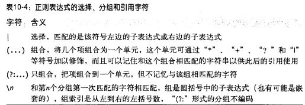
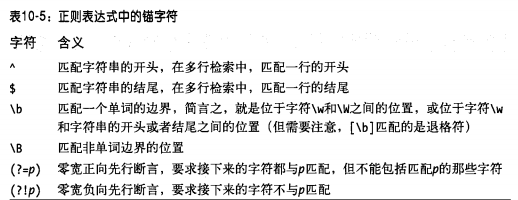
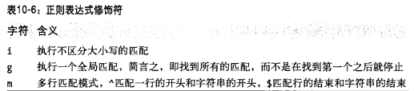

# 10 正则表达式

javaScript的RegExp类表示正则表达式

##　10.1　定义

构造函数
```
var pattern = new RegExp("s$");
```
直接量：
```
var pattern = /s$/;
```

+ 直接量字符

正则表达式中的直接量字符
|   字符  |   匹配|
|:------|:------|
|   字母和数字字符 |   自身  |
| \o  | NULL字符(\u0000) |
|  \t |  制表符（\u0009） |
|  \n | 换行\u000A   |
|  \v | 垂直制表符\u000B  |
|  \f |  换页符\u000C |
|  \r |  回车符\u000D |
|  \xnn |  由十六进制数nn指定拉丁字符 |
|  \uxxxx | 有十六进制数xxxx指定的Unicode字符  |
|  \cX | 控制符^X  |

特殊表达式：
```
^ $ . * + ? = ! : | \ / ( ) [ ] { }
```

+ 字符类

|   字符  |   匹配|
|:------|:------|
|   [...]    |    方括号内的任意字符   |
|  [^...]     |    不在方括号内的任意字符   |
|  .     |    除换行符合其他Unicode行终止符之外的任意字符   |
|  \w     |   任何单词[a-zA-Z0-9]    |
|  \W    |    任何非单词[^a-zA-Z0-9]   |
|  \s     |   任何Unicode空白符    |
|  \S     |   任何非Unicode空白符的字符    |
|  \d     |   任何ASCII数字　［0-9］    |
|  \D     |    任何非数字 [^0-9]   |
|  [\b]     |  退格直接量     |

+  重复

|   字符  |   匹配|
|:------|:------|
|   {n,m}       |     匹配前一项至少N次，但不能超过m次       |
|   {n,}       |      匹配前一项至少N次或更多       |
|    {n}      |     匹配前一项N次       |
|    ?      |  {0,1}          |
|    +      |    {1,}        |
|    *      |      {0,}      |

+ 选择、分组和引用


匹配三位数字或者4个小写字母:`/\d{3}|[a-z]{4}/`    
单引号或者双引号的0-N个字符：`/['"][^'"]*['"]/`
匹配左侧和右侧的引号：`/(['"])[^'"]*\1/`



+ 指定匹配位置



+ 修饰符



## 用于模式匹配的String方法

+ search()
```
"JavaScript".search(/script/i);
```

+ replace()
```
// No matter how it is capitalized, replace it with the correct capitalization
text.replace(/javascript/gi, "JavaScript");
```

```
// A quote is a quotation mark, followed by any number of
// nonquotation-mark characters (which we remember), followed
// by another quotation mark.
var quote = /"([^"]*)"/g;
// Replace the straight quotation marks with curly quotes,
// leaving the quoted text (stored in $1) unchanged.
text.replace(quote, '“$1”');
```
+ match()

```
"1 plus 2 equals 3".match(/\d+/g)  // returns ["1", "2", "3"]
```
```
var url = /(\w+):\/\/([\w.]+)\/(\S*)/;
var text = "Visit my blog at http://www.example.com/~david";
var result = text.match(url);
if (result != null) {
    var fullurl = result[0];   // Contains "http://www.example.com/~david"
    var protocol = result[1];  // Contains "http"
    var host = result[2];      // Contains "www.example.com"
    var path = result[3];      // Contains "~david"
}
```

+ split()

```
"123,456,789".split(",");  // Returns ["123","456","789"]

"1, 2, 3, 4, 5".split(/\s*,\s*/); // Returns ["1","2","3","4","5"]
```

## 10.3 正则表达式对象

```
// Find all five-digit numbers in a string. Note the double \\ in this case.
var zipcode = new RegExp("\\d{5}", "g");
```

+ RegExp属性

每个RegExp对象都包括5个属性：
1. source：一个只读字符串，包含正则表达式的文本
2. global：一个只读的Boolean，说明是否带g
3. ignoreCase：一个只读的Boolean，说明是否带i
4. multiline：一个只读的Boolean,说明是否带m
5. lastIndex :可读写的整数

+ RegExp方法

exec()
```
var pattern = /Java/g;
var text = "JavaScript is more fun than Java!";
var result;
while((result = pattern.exec(text)) != null) {
    alert("Matched '" + result[0] + "'" +
          " at position " + result.index +
          "; next search begins at " + pattern.lastIndex);
}
```

test()
```
var pattern = /java/i;
pattern.test("JavaScript");  // Returns true
```