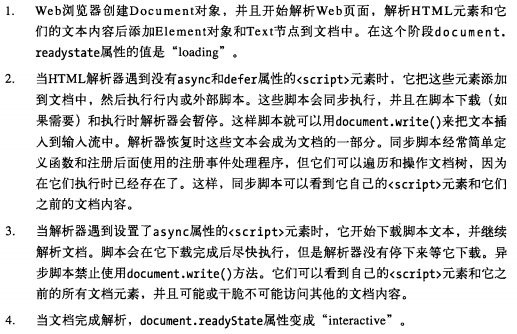

# 13 web浏览器端Javascript

## 13.1 客户端Javascript

Window对象是所有客户端Javascript特性和API的主要接入点。也是全局对象。

location属性：
```
// Set the location property to navigate to a new web page
window.location = "http://www.oreilly.com/";
```

alert()方法:弹窗
setTime()：计时
```
// Wait 2 seconds and then say hello
setTimeout(function() { alert("hello world"); }, 2000);
```

Window.document属性
```
// Find the element with id="timestamp"
var timestamp = document.getElementById("timestamp");

// If the element is empty, then insert the current date and time into it
if (timestamp.firstChild == null)
    timestamp.appendChild(document.createTextNode(new Date().toString()));

// Explicitly alter the presentation of the heading element
timestamp.style.backgroundColor = "yellow";
// Or just change the class and let the stylesheet specify the details:
timestamp.className = "highlight";
```

Window,Document,Element对象上的事件处理属性onXXX()
```
// Update the content of the timestamp element when the user clicks on it
timestamp.onclick = function() { this.innerHTML = new Date().toString(); }
```
显示内容的简单Javascript
```
<!DOCTYPE html>
<html>
<head>
<style>
/* CSS styles for this page */
.reveal * { display: none; }  /* Children of class="reveal" are  not shown */
.reveal *.handle { display: block;} /* Except for the class="handle" child */
</style>
<script>
// Don't do anything until the entire document has loaded
window.onload = function() {
    // Find all container elements with class "reveal"
    var elements = document.getElementsByClassName("reveal");
    for(var i = 0; i < elements.length; i++) {  // For each one...
        var elt = elements[i];
        // Find the "handle" element with the container
        var title = elt.getElementsByClassName("handle")[0];
        // When that element is clicked, reveal the rest of the content
        title.onclick = function() {
            if (elt.className == "reveal") elt.className = "revealed";
            else if (elt.className == "revealed") elt.className = "reveal";
        }
    }
};
</script>
</head>
<body>
<div class="reveal">
<h1 class="handle">Click Here to Reveal Hidden Text</h1>
<p>This paragraph is hidden. It appears when you click on the title.</p>
</div>
</body>
</html>
```

+ web文档里的Javascript
文档中应少量使用Javascript。用户体验不应依赖于Javascript，但是Javascript可以增强体验：
1. 创建动画或者其他视觉效果，巧妙地引导和帮助用户进行页面导航。
2. 对表格的列进行分组，让用户更容易找到所需要的。
3. 隐藏某些内容，当用户‘深入’到内容里时，再逐渐展示详细信息

+ web应用里面的Javascript


## 13.2 HTML里嵌入Javascript

4种方法：
1. 内联，放在`<script></script>`里
2. 放在 `<script>` 标签的src属性指定的外部文件里
3. 放在HTML处理程序里，如onclick()
4. 放在URL里使用特殊的`javascript:`协议

+ 内联：

```
<!DOCTYPE html>                 <!-- This is an HTML5 file -->
<html>                          <!-- The root element -->
<head>                          <!-- Title, scripts & styles go here -->
<title>Digital Clock</title>
<script>                        // A script of js code
// Define a function to display the current time
function displayTime() {
    var elt = document.getElementById("clock");  // Find element with id="clock"
    var now = new Date();                        // Get current time
    elt.innerHTML = now.toLocaleTimeString();    // Make elt display it
    setTimeout(displayTime, 1000);               // Run again in 1 second
}
window.onload = displayTime;  // Start displaying the time when document loads.
</script>
<style>                         /* A CSS stylesheet for the clock */
#clock {                        /* Style apply to element with id="clock" */
  font: bold 24pt sans;         /* Use a big bold font */
  background: #ddf;             /* On a light bluish-gray background */
  padding: 10px;                /* Surround it with some space */
  border: solid black 2px;      /* And a solid black border */
  border-radius: 10px;          /* Round the corners (where supported) */
}
</style>
</head>
<body>                    <!-- The body is the displayed parts of the doc. -->
<h1>Digital Clock</h1>    <!-- Display a title -->
<span id="clock"></span>  <!-- The time gets inserted here -->
</body>
</html>
```

+ 外部文件脚本
常用，注意安全性。因为以下优点：
1. 简化HTML
2. 方便多页面共享
3. src可以使任意URL，
4. 更好利用缓存

+ HTML里事件处理

```
<input type="checkbox" name="options" value="giftwrap"
       onchange="order.options.giftwrap = this.checked;">
```

+ URL的Javascript

```
<a href="javascript:new Date().toLocaleTimeString();">
What time is it?
</a>

<a href="javascript:alert(new Date().toLocaleTimeString());">
Check the time without overwriting the document
</a>

<a href="javascript:void window.open('about:blank');">Open Window</a>
```
书签
```
<a href='javascript:
  var e = "", r = ""; /* Expression to evaluate and the result */
  do {
      /* Display expression and result and ask for a new expression */
      e = prompt("Expression: " + e + "\n" + r + "\n", e);
      try { r = "Result: " + eval(e); } /* Try to evaluate the expression */
      catch(ex) { r = ex; }             /* Or remember the error instead  */
  } while(e);  /* Continue until no expression entered or Cancel clicked */
  void 0;      /* This prevents the current document from being overwritten */
  '>
JavaScript Evaluator
</a>
```
## 13.3 执行Javascript程序

执行阶段：
1. 载入文档内容，并执行<script>元素中的代码（包括外联和内联脚本）。默认按文档的出现顺序，从上往下，遵循控制语句执行
2. 载入文档后且所有脚本执行后，进入异步执行阶段，由事件驱动。事件驱动的第一个事件是load事件。

Javascript都是一个单线程执行模型。脚本与事件处理同一时间只能执行一个，没有并发性。

document.write()
```
<h1>Table of Factorials</h1>
<script>
function factorial(n) {                 // A function to compute factorials
    if (n <= 1) return n;
    else return n*factorial(n-1);
}
document.write("<table>");                         // Begin an HTML table
document.write("<tr><th>n</th><th>n!</th></tr>");  // Output table header
for(var i = 1; i <= 10; i++) {                     // Output 10 rows
    document.write("<tr><td>" + i + "</td><td>" + factorial(i) + "</td></tr>");
}
document.write("</table>");                        // End the table
document.write("Generated at " + new Date());      // Output a timestamp
</script>
```

异步载入并执行脚本：
```
// Asynchronously load and execute a script from a specified URL
function loadasync(url) { 
    var head = document.getElementsByTagName("head")[0]; // Find document <head>
    var s = document.createElement("script");  // Create a <script> element
    s.src = url;                               // Set its src attribute 
    head.appendChild(s);                       // Insert the <script> into head
}
```

+ 事件驱动：

```
window.onload = function() { ... };
document.getElementById("button1").onclick = function() { ... };
function handleResponse() { ... }
request.onreadystatechange = handleResponse;
```

注册监听
```
window.addEventListener("load", function() {...}, false);
request.addEventListener("readystatechange", function() {...}, false);
```

IE8 代替
```
window.attachEvent("onload", function() {...});
```

onLoad调用：
```
// Register the function f to run when the document finishes loading.
// If the document has already loaded, run it asynchronously ASAP.
function onLoad(f) {
    if (onLoad.loaded)                  // If document is already loaded
        window.setTimeout(f, 0);        // Queue f to be run as soon as possible
    else if (window.addEventListener)   // Standard event registration method
        window.addEventListener("load", f, false);
    else if (window.attachEvent)        // IE8 and earlier use this instead
        window.attachEvent("onload", f);
}
// Start by setting a flag that indicates that the document is not loaded yet.
onLoad.loaded = false;
// And register a function to set the flag when the document does load.
onLoad(function() { onLoad.loaded = true; });
```

+ 客户端Javascript 线程模型

HTML5 后台线程 "WebWorker"

+ 客户端Javascript时间线


