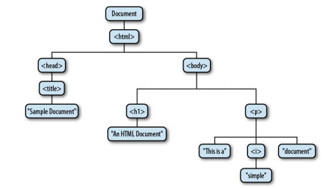
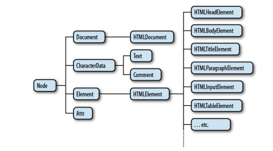
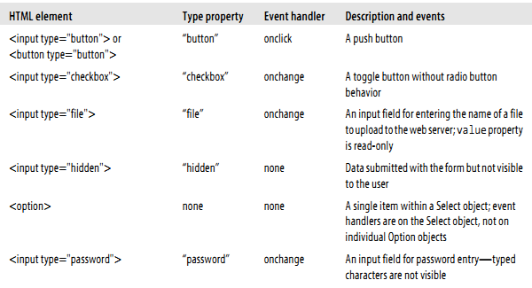
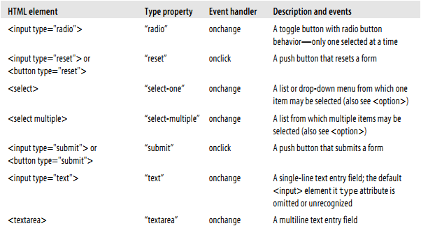

# 15 DOM 文档

DOM文档对象模型，代表和操作文档的内容。

## 15.1 DOM概览

DOM表示和操作HTML和XML文档内容中的基础API。

```
<html>
  <head>
    <title>Sample Document</title>
  </head>
  <body>
    <h1>An HTML Document</h1>
    <p>This is a <i>simple</i> document.
</html>
```





# 15.2 选取文档元素

选取文档元素的方法：指定id,name,标签，css类，匹配指定的css选择器

+ 通过ID选取元素

```
/**
 * This function expects any number of string arguments. It treats each 
 * argument as an element id and calls document.getElementById() for each.
 * Returns an object that maps ids to the corresponding Element object.
 * Throws an Error object if any of the ids is undefined.
 */
function getElements(/*ids...*/) {
    var elements = {};                           // Start with an empty map
    for(var i = 0; i < arguments.length; i++) {  // For each argument
        var id = arguments[i];                   // Argument is an element id
        var elt = document.getElementById(id);   // Look up the Element
        if (elt == null)                         // If not defined, 
            throw new Error("No element with id: " + id); // throw an error
        elements[id] = elt;                      // Map id to element
    }
    return elements;                             // Return id to element map
}
```

+ 通过名字选取元素

```
var radiobuttons = document.getElementsByName("favorite_color");

// Get the Element object for the <form name="shipping_address"> element
var form = document.shipping_address;
```

+ 通过标签名选取元素

```
var spans = document.getElementsByTagName("span");

var firstpara = document.getElementsByTagName("p")[0];

document.shipping_address

document.forms.shipping_address;
```

+ 通过css类选取元素

```
// Find all elements that have "warning" in their class attribute
var warnings = document.getElementsByClassName("warning");
// Find all descendants of the element named "log" that have the class
// "error" and the class "fatal"
var log = document.getElementById("log");
var fatal = log.getElementsByClassName("fatal error");
```

+ 通过css选择器选择元素

```
#nav                    // An element with id="nav"
div                     // Any <div> element
.warning                // Any element with "warning" in its class attribute
```

jquery的 Sizzle

+ document.all[]

```
document.all[0]           // The first element in the document
document.all["navbar"]    // Element (or elements) with id or name "navbar"
document.all.navbar       // Ditto
document.all.tags("div")  // All <div> elements in the document
document.all.tags("p")[0] // The first <p> in the document
```

## 15.3 文档结构和遍历

+ 作为节点树的文档

1. parentNode

The Node that is the parent of this one, or null for nodes like the Document object
that have no parent.

2. childNodes

A read-only array-like object (a NodeList) that is a live representation of a Node’s
child nodes.

3. firstChild, lastChild

The first and last child nodes of a node, or null if the node has no children.

4. nextSibling, previousSibling

The next and previous sibling node of a node. Two nodes with the same parent are
siblings. Their order reflects the order in which they appear in the document. These
properties connect nodes in a doubly linked list.

5. nodeType

The kind of node this is. Document nodes have the value 9. Element nodes have
the value 1. Text nodes have the value 3. Comments nodes are 8 and Document-
Fragment nodes are 11.

6. nodeValue

The textual content of a Text or Comment node.

7. nodeName

The tag name of an Element, converted to uppercase.

```
document.childNodes[0].childNodes[1]
document.firstChild.firstChild.nextSibling
```

+ 作为元素树的文档
```
/**
 * Return the nth ancestor of e, or null if there is no such ancestor
 * or if that ancestor is not an Element (a Document or DocumentFragment e
 * If n is 0 return e itself.  If n is 1 (or
 * omitted) return the parent.  If n is 2, return the grandparent, etc.  
 */
function parent(e, n) {
    if (n === undefined) n = 1;
    while(n-- && e) e = e.parentNode;
    if (!e || e.nodeType !== 1) return null;
    return e;
}
/**
 * Return the nth sibling element of Element e.
 * If n is postive return the nth next sibling element.
 * If n is negative, return the -nth previous sibling element.
 * If n is zero, return e itself.
 */
 
 function sibling(e,n) {
     while(e && n !== 0) {  // If e is not defined we just return it
         if (n > 0) {  // Find next element sibling
             if (e.nextElementSibling) e = e.nextElementSibling;
             else {
                 for(e=e.nextSibling; e && e.nodeType !== 1; e=e.nextSibling)
                     /* empty loop */ ;
             }
             n--;
         }
         else {        // Find the previous element sibling
             if (e.previousElementSibing) e = e.previousElementSibling;
             else {
                 for(e=e.previousSibling; e&&e.nodeType!==1; e=e.previousSibling)
                     /* empty loop */ ;
             }
             n++;
        }
    }
    return e;
}
/**
 * Return the nth element child of e, or null if it doesn't have one.
 * Negative values of n count from the end. 0 means the first child, but
 * -1 means the last child, -2 means the second to last, and so on.
 */
 
 function child(e, n) {
     if (e.children) {                      // If children array exists
         if (n < 0) n += e.children.length; // Convert negative n to array index
         if (n < 0) return null;            // If still negative, no child
         return e.children[n];              // Return specified child
     }
     // If e does not have a children array, find the first child and count
     // forward or find the last child and count backwards from there.
     if (n >= 0) { // n is non-negative: count forward from the first child
         // Find the first child element of e
         if (e.firstElementChild) e = e.firstElementChild;
         else {
             for(e = e.firstChild; e && e.nodeType !== 1; e = e.nextSibling)
                 /* empty */;
         }
         return sibling(e, n); // Return the nth sibling of the first child
     }
     else { // n is negative, so count backwards from the end
         if (e.lastElementChild) e = e.lastElementChild;
         else {
             for(e = e.lastChild; e && e.nodeType !== 1; e=e.previousSibling)
                 /* empty */;
         }
         return sibling(e, n+1); // +1 to convert child -1 to sib 0 of last
     }
 }
```

##　15.4 属性

+ HTML属性作为Element的属性

```
var image = document.getElementById("myimage"); 
var imgurl = image.src;   // The src attribute is the URL of the image
image.id === "myimage"    // Since we looked up the image by id
```
```
var f = document.forms[0];                      // First <form> in the document
f.action = "http://www.example.com/submit.php"; // Set URL to submit it to.
f.method = "POST";                              // HTTP request type
```

+ 获取和设置非标准的HTML属性

```
var image = document.images[0];
var width = parseInt(image.getAttribute("WIDTH")); 
image.setAttribute("class", "thumbnail");
```

+ 数据集属性
```
// Assumes the ES5 Array.map() method (or a work-alike) is defined
var sparklines = document.getElementsByClassName("sparkline");
for(var i = 0; i < sparklines.length; i++) {
    var dataset = sparklines[i].dataset;
    var ymin = parseFloat(dataset.ymin);
    var ymax = parseFloat(dataset.ymax);
    var data = sparklines[i].textContent.split(" ").map(parseFloat);
    drawSparkline(sparklines[i], ymin, ymax, data);  // Not yet implemented
}    
```

```
var sparklines = document.getElementsByClassName("sparkline");
for(var i = 0; i < sparklines.length; i++) {
    var elt = sparklines[i];
    var ymin = parseFloat(elt.getAttribute("data-ymin"));
    var ymin = parseFloat(elt.getAttribute("data-ymax"));
    var points = elt.getAttribute("data-points");
    var data = elt.textContent.split(" ").map(parseFloat);
    drawSparkline(elt, ymin, ymax, data);  // Not yet implemented
}
```

+ attr节点的属性

```
document.body.attributes[0]        // The first attribute of the <body> elt
document.body.attributes.bgcolor   // The bgcolor attribute of the <body> elt
document.body.attributes["ONLOAD"] // The onload attribute of the <body> elt
```

## 15.5  元素内容

+ 作为Html的元素内容

web浏览器擅长解析HTML。设置innerHtml 效率也很高。但是对`innerHTML` 的`+=`操作符效率不佳，因为既要序列化又要解析

+ 作为村文本的元素内容

```
var para = document.getElementsByTagName("p")[0];  // First <p> in the document
var text = para.textContent;        // Text is "This is a simple document."
para.textContent = "Hello World!";  // Alter paragraph content
```

```
/**
 * With one argument, return the textContent or innerText of the element.
 * With two arguments, set the textContent or innerText of element to value.
 */
function textContent(element, value) {
    var content = element.textContent;  // Check if textContent is defined
    if (value === undefined) { // No value passed, so return current text
        if (content !== undefined) return content;
        else return element.innerText;
    }
    else {                     // A value was passed, so set text
        if (content !== undefined) element.textContent = value;
        else element.innerText = value;
    }
}
```

+ 作为text节点的元素内容

查找所有元素子节点中的text节点
```
// Return the plain-text content of element e, recursing into child elements.
// This method works like the textContent property
function textContent(e) {
    var child, type, s = "";  // s holds the text of all children
    for(child = e.firstChild; child != null; child = child.nextSibling) {
        type = child.nodeType;
        if (type === 3 || type === 4)  // Text and CDATASection nodes
            s += child.nodeValue;
        else if (type === 1)           // Recurse for Element nodes
            s += textContent(child);
    }
    return s;
}
```

将节点下的text节点内容转为大写
```
// Recursively convert all Text node descendants of n to uppercase.
function upcase(n) {
    if (n.nodeType == 3 || n.nodeTyep == 4) // If n is Text or CDATA
        n.data = n.data.toUpperCase();      // ...convert content to uppercase.
    else                                    // Otherwise, recurse on child nodes
        for(var i = 0; i < n.childNodes.length; i++)
            upcase(n.childNodes[i]);
}
```

## 15.6 创建、插入和删除节点
```
// Asynchronously load and execute a script from a specified URL
function loadasync(url) { 
    var head = document.getElementsByTagName("head")[0]; // Find document <head>
    var s = document.createElement("script");  // Create a <script> element
    s.src = url;                               // Set its src attribute 
    head.appendChild(s);                       // Insert the <script> into head
}
```

+ 创建节点
```
var newnode = document.createTextNode("text node content");
```

+ 插入节点

```
// Insert the child node into parent so that it becomes child node n
function insertAt(parent, child, n) {
    if (n < 0 || n > parent.childNodes.length) throw new Error("invalid index");
    else if (n == parent.childNodes.length) parent.appendChild(child);
    else parent.insertBefore(child, parent.childNodes[n]);
}
```

表格的行排序
```
// Sort the rows in first <tbody> of the specified table according to
// the value of nth cell within each row. Use the comparator function
// if one is specified. Otherwise, compare the values alphabetically.
function sortrows(table, n, comparator) {
    var tbody = table.tBodies[0]; // First <tbody>; may be implicitly created
    var rows = tbody.getElementsByTagName("tr"); // All rows in the tbody
    rows = Array.prototype.slice.call(rows,0);   // Snapshot in a true array
    // Now sort the rows based on the text in the nth <td> element
    rows.sort(function(row1,row2) {
        var cell1 = row1.getElementsByTagName("td")[n];  // Get nth cell
        var cell2 = row2.getElementsByTagName("td")[n];  // of both rows
        var val1 = cell1.textContent || cell1.innerText; // Get text content
        var val2 = cell2.textContent || cell2.innerText; // of the two cells
        if (comparator) return comparator(val1, val2);   // Compare them!
        if (val1 < val2) return -1;
        else if (val1 > val2) return 1;
        else return 0;
    });
    // Now append the rows into the tbody in their sorted order.
    // This automatically moves them from their current location, so there
    // is no need to remove them first. If the <tbody> contains any
    // nodes other than <tr> elements, those nodes will float to the top.
    for(var i = 0; i < rows.length; i++) tbody.appendChild(rows[i]);
}
// Find the <th> elements of the table (assuming there is only one row of them)
// and make them clickable so that clicking on a column header sorts
// by that column.
function makeSortable(table) {
    var headers = table.getElementsByTagName("th");
    for(var i = 0; i < headers.length; i++) {
        (function(n) {  // Nested funtion to create a local scope
            headers[i].onclick = function() { sortrows(table, n); };
        }(i));          // Assign value of i to the local variable n
    }
}    
```

+ 删除和替换节点

删除
```
n.parentNode.removeChild(n);
```

替换
```
n.parentNode.replaceChild(document.createTextNode("[ REDACTED ]"), n);
```

```
// Replace the node n with a new <b> element and make n a child of that element.
function embolden(n) {
    // If we're passed a string instead of a node, treat it as an element id
    if (typeof n == "string") n = document.getElementById(n);
    var parent = n.parentNode;           // Get the parent of n
    var b = document.createElement("b"); // Create a <b> element
    parent.replaceChild(b, n);           // Replace n with the <b> element
    b.appendChild(n);                    // Make n a child of the <b> element
}
```

用innerHTML实现outerHTML属性
```
// Implement the outerHTML property for browsers that don't support it.
// Assumes that the browser does support innerHTML, has an extensible 
// Element.prototype, and allows getters and setters to be defined.
(function() {
    // If we already have outerHTML return without doing anything
    if (document.createElement("div").outerHTML) return;
    
    // Return the outer HTML of the element referred to by this
    function outerHTMLGetter() {
        var container = document.createElement("div"); // Dummy element
        container.appendChild(this.cloneNode(true));   // Copy this to dummy
        return container.innerHTML;                    // Return dummy content
    }
    
    // Set the outer HTML of the this element to the specified value
    function outerHTMLSetter(value) {
        // Create a dummy element and set its content to the specified value
        var container = document.createElement("div");
        container.innerHTML = value;
        // Move each of the nodes from the dummy into the document
        while(container.firstChild)  // Loop until container has no more kids
            this.parentNode.insertBefore(container.firstChild, this);
        // And remove the node that has been replaced
        this.parentNode.removeChild(this);
    }
    // Now use these two functions as getters and setters for the 
    // outerHTML property of all Element objects. Use ES5 Object.defineProperty
    // if it exists and otherwise fall back on __defineGetter__ and Setter__.
    if (Object.defineProperty) {
        Object.defineProperty(Element.prototype, "outerHTML", {
                                  get: outerHTMLGetter,
                                  set: outerHTMLSetter,
                                  enumerable: false, configurable: true
                              });
    }
    else {
        Element.prototype.__defineGetter__("outerHTML", outerHTMLGetter);
        Element.prototype.__defineSetter__("outerHTML", outerHTMLSetter);
    }
}());

```

+ 使用DocumentFragment

```
var frag = document.createDocumentFragment();
```

排序子节点

```
// Reverse the order of the children of Node n
function reverse(n) {
    // Create an empty DocumentFragment as a temporary container
    var f = document.createDocumentFragment();
    // Now loop backward through the children, moving each one to the fragment.
    // The last child of n becomes the first child of f, and vice-versa.
    // Note that appending a child to f automatically removes it from n.
    while(n.lastChild) f.appendChild(n.lastChild);
    // Finally, move the children of f all at once back to n, all at once.
    n.appendChild(f);
}
```

使用innerHTML实现insertAdjacentHTML()
```
// This module defines Element.insertAdjacentHTML for browsers that don't 
// support it, and also defines portable HTML insertion functions that have
// more logical names than insertAdjacentHTML:
//     Insert.before(), Insert.after(), Insert.atStart(), Insert.atEnd()
var Insert = (function() {
    // If elements have a native insertAdjacentHTML, use it in four HTML
    // insertion functions with more sensible names.
    if (document.createElement("div").insertAdjacentHTML) {
        return {
            before: function(e,h) {e.insertAdjacentHTML("beforebegin",h);},
            after: function(e,h) {e.insertAdjacentHTML("afterend",h);},
            atStart: function(e,h) {e.insertAdjacentHTML("afterbegin",h);},
            atEnd: function(e,h) {e.insertAdjacentHTML("beforeend",h);}
        };
    }
    // Otherwise, we have no native insertAdjacentHTML. Implement the same
    // four insertion functions and then use them to define insertAdjacentHTML.
    // First, define a utility method that takes a string of HTML and returns
    // a DocumentFragment containing the parsed representation of that HTML.
    function fragment(html) {
        var elt = document.createElement("div");      // Create empty element
        var frag = document.createDocumentFragment(); // Create empty fragment
        elt.innerHTML = html;                         // Set element content
        while(elt.firstChild)                         // Move all nodes
            frag.appendChild(elt.firstChild);         //    from elt to frag
        return frag;                                  // And return the frag
    }
    var Insert = {
        before: function(elt, html) {
            elt.parentNode.insertBefore(fragment(html), elt);
        },
        after: function(elt, html) {
            elt.parentNode.insertBefore(fragment(html),elt.nextSibling);
        },
        atStart: function(elt, html) {
            elt.insertBefore(fragment(html), elt.firstChild);
        },
        atEnd: function(elt, html) { elt.appendChild(fragment(html)); }
    };
    // Now implement insertAdjacentHTML based on the functions above
    Element.prototype.insertAdjacentHTML = function(pos, html) {
        switch(pos.toLowerCase()) {
        case "beforebegin": return Insert.before(this, html);
        case "afterend": return Insert.after(this, html);
        case "afterbegin": return Insert.atStart(this, html);
        case "beforeend": return Insert.atEnd(this, html);
        }
    };
    return Insert;  // Finally return the four insertion function
}());


```

## 15.7 生成目录表
```
/**
 * TOC.js: create a table of contents for a document.
 * 
 * This module registers an anonymous function that runs automatically
 * when the document finishes loading. When it runs, the function first
 * looks for a document element with an id of "TOC". If there is no
 * such element it creates one at the start of the document.
 * 
 * Next, the function finds all <h1> through <h6> tags, treats them as
 * section titles, and creates a table of contents within the TOC
 * element. The function adds section numbers to each section heading
 * and wraps the headings in named anchors so that the TOC can link to
 * them. The generated anchors have names that begin with "TOC", so
 * you should avoid this prefix in your own HTML.
 * 
 * The entries in the generated TOC can be styled with CSS. All entries have
 * a class "TOCEntry". Entries also have a class that corresponds to the level
 * of the section heading. <h1> tags generate entries of class "TOCLevel1", 
 * <h2> tags generate entries of class "TOCLevel2", and so on. Section numbers
 * inserted into headings have class "TOCSectNum".
 *
 * You might use this module with a stylesheet like this:
 *
 *   #TOC { border: solid black 1px; margin: 10px; padding: 10px; }
 *   .TOCEntry { font-family: sans-serif; }
 *   .TOCEntry a { text-decoration: none; }
 *   .TOCLevel1 { font-size: 16pt; font-weight: bold; }
 *   .TOCLevel2 { font-size: 12pt; margin-left: .5in; }
 *   .TOCSectNum:after { content: ": "; }
 * 
 * That final line generates a colon and space after section numbers. To hide
 * the section numbers, use this:
 *   
 *   .TOCSectNum { display: none }
 *
 * This module requires the onLoad() utility function.
 **/
 
onLoad(function() { // Anonymous function defines a local scope
    // Find the TOC container element.
    // If there isn't one, create one at the start of the document.
    var toc = document.getElementById("TOC");
    if (!toc) {
        toc = document.createElement("div");
        toc.id = "TOC";
        document.body.insertBefore(toc, document.body.firstChild);
    }
    // Find all section heading elements
    var headings;
    if (document.querySelectorAll) // Can we do it the easy way?
        headings = document.querySelectorAll("h1,h2,h3,h4,h5,h6");
    else   // Otherwise, find the headings the hard way
        headings = findHeadings(document.body, []);
    // Recursively traverse the document body looking for headings
    function findHeadings(root, sects) {
        for(var c = root.firstChild; c != null; c = c.nextSibling) {
            if (c.nodeType !== 1) continue;
            if (c.tagName.length == 2 && c.tagName.charAt(0) == "H")
                sects.push(c);
            else 
                findHeadings(c, sects);
        }
        return sects;
    }
    // Initialize an array that keeps track of section numbers.
    var sectionNumbers = [0,0,0,0,0,0];
    // Now loop through the section header elements we found.   
    for(var h = 0; h < headings.length; h++) {
        var heading = headings[h];
        // Skip the section heading if it is inside the TOC container.
        if (heading.parentNode == toc) continue;
        // Figure out what level heading it is.
        var level = parseInt(heading.tagName.charAt(1));
        if (isNaN(level) || level < 1 || level > 6) continue;
        // Increment the section number for this heading level
        // and reset all lower heading level numbers to zero.
        sectionNumbers[level-1]++;
        for(var i = level; i < 6; i++) sectionNumbers[i] = 0;
        // Now combine section numbers for all heading levels
        // to produce a section number like 2.3.1.
        var sectionNumber = sectionNumbers.slice(0,level).join(".")
        // Add the section number to the section header title.
        // We place the number in a <span> to make it styleable.
        var span = document.createElement("span");
        span.className = "TOCSectNum";            
        span.innerHTML = sectionNumber;                
        heading.insertBefore(span, heading.firstChild);
        // Wrap the heading in a named anchor so we can link to it.
        var anchor = document.createElement("a");
        anchor.name = "TOC"+sectionNumber; 
        heading.parentNode.insertBefore(anchor, heading);
        anchor.appendChild(heading);
        // Now create a link to this section.
        var link = document.createElement("a");
        link.href = "#TOC" + sectionNumber; // Link destination
        link.innerHTML = heading.innerHTML; // Link text is same as heading
        // Place the link in a div that is styleable based on the level.
        var entry = document.createElement("div");
        entry.className = "TOCEntry TOCLevel" + level; 
        entry.appendChild(link);
        // And add the div to the TOC container.
        toc.appendChild(entry);
    }
});
```

## 15.8 文档和元素的几何形状和滚动

+ 文档坐标和视口坐标

查询窗口滚动条的位置
```
// Return the current scrollbar offsets as the x and y properties of an object
function getScrollOffsets(w) {
    // Use the specified window or the current window if no argument
    w = w || window;
    // This works for all browsers except IE versions 8 and before
    if (w.pageXOffset != null) return {x: w.pageXOffset, y:w.pageYOffset};
    // For IE (or any browser) in Standards mode
    var d = w.document;
    if (document.compatMode == "CSS1Compat")
        return {x:d.documentElement.scrollLeft, y:d.documentElement.scrollTop};
    // For browsers in Quirks mode
    return { x: d.body.scrollLeft, y: d.body.scrollTop };
}
```

查询窗口的视口尺寸
```
// Return the viewport size as w and h properties of an object
function getViewportSize(w) {
    // Use the specified window or the current window if no argument
    w = w || window;  
    // This works for all browsers except IE8 and before
    if (w.innerWidth != null) return {w: w.innerWidth, h:w.innerHeight};
    // For IE (or any browser) in Standards mode
    var d = w.document;
    if (document.compatMode == "CSS1Compat")
        return { w: d.documentElement.clientWidth,
                 h: d.documentElement.clientHeight };
    // For browsers in Quirks mode
    return { w: d.body.clientWidth, h: d.body.clientWidth };
}    
```

查询元素的集合尺寸
```
var box = e.getBoundingClientRect();  // Get position in viewport coordinates
var offsets = getScrollOffsets();     // Utility function defined above
var x = box.left + offsets.x;         // Convert to document coordinates
var y = box.top + offsets.y;
```
```
var box = e.getBoundingClientRect();
var w = box.width || (box.right - box.left);
var h = box.height || (box.bottom - box.top);
```

+ 判断元素在某点

elementFromPoint()不常用

+ 滚动

```
// Get the height of the document and viewport. offsetHeight is explained below.
var documentHeight = document.documentElement.offsetHeight;
var viewportHeight = window.innerHeight; // Or use getViewportSize() above
// And scroll so the last "page" shows in the viewport
window.scrollTo(0, documentHeight - viewportHeight);


// Scroll 10 pixels down every 200 ms. Note there is no way to turn this off!
javascript:void setInterval(function() {scrollBy(0,10)}, 200);
```

+ 元素的尺寸、位置和溢出等

获取元素位置
```
function getElementPosition(e) {
    var x = 0, y = 0;
    while(e != null)  {
        x += e.offsetLeft;
        y += e.offsetTop;
        e = e.offsetParent;
    }
    return {x:x, y:y};
}        
```

每个元素都有以下属性：
```
offsetWidth         clientWidth          scrollWidth
offsetHeight        clientHeight         scrollHeight
offsetLeft          clientLeft           scrollLeft
offsetTop           clientTop            scrollTop
offsetParent
```

获取元素位置 update
```
function getElementPos(elt) {
    var x = 0, y = 0;
    // Loop to add up offsets
    for(var e = elt; e != null; e = e.offsetParent) {
        x += e.offsetLeft;
        y += e.offsetTop;
    }
    // Loop again, through all ancestor elements to subtract scroll offsets.
    // This subtracts the main scrollbars, too, and converts to viewport coords.
    for(var e=elt.parentNode; e != null && e.nodeType == 1; e=e.parentNode) {
        x -= e.scrollLeft;
        y -= e.scrollTop;
    }
    return {x:x, y:y};
}
```

## 15.9 HTML表单




+ 选取表单和表单元素

```
var fields = document.getElementById("address").getElementsByTagName("input");
```
```
// All radio buttons in the form with id "shipping"
document.querySelectorAll('#shipping input[type="radio"]');
// All radio buttons with name "method" in form with id "shipping"
document.querySelectorAll('#shipping input[type="radio"][name="method"]');
```
```
window.address            // Brittle: do not use
document.address          // Only works for forms with name attribute
document.forms.address    // Explicit access to a form with name or id
document.forms[n]         // Brittle: n is the form's numerical position
```

```
<form name="shipping">
  <fieldset><legend>Shipping Method</legend>
    <label><input type="radio" name="method" value="1st">First-class</label>
    <label><input type="radio" name="method" value="2day">2-day Air</label>
    <label><input type="radio" name="method" value="overnite">Overnight</label>
  </fieldset>
</form>

var methods = document.forms.shipping.elements.method;

var shipping_method;
for(var i = 0; i < methods.length; i++)
    if (methods[i].checked) shipping_method = methods[i].value;
```

+ 表单和元素的属性

常见属性： type form name value

+ 表单和元素的时间处理程序

+ button
 
+ radio button

+ textarea

+ checkbox

## 15.10 其他文档属性

+ Document的属性

1. cookie
2. dimain
3. lastModified
4. location
5. referrer
6. title
7. URL

```
if (document.referrer.indexOf("http://www.google.com/search?") == 0) {
    var args = document.referrer.substring(ref.indexOf("?")+1).split("&");
    for(var i = 0; i < args.length; i++) {
        if (args[i].substring(0,2) == "q=") {
            document.write("<p>Welcome Google User. ");
            document.write("You searched for: " +
                           unescape(args[i].substring(2)).replace('+', ' ');
            break;
        }
    }
}
```

+ document.write()

```
<script>
  document.write("<p>Document title: " + document.title);
  document.write("<br>URL: " + document.URL);
  document.write("<br>Referred by: " + document.referrer);
  document.write("<br>Modified on: " + document.lastModified);
  document.write("<br>Accessed on: " + new Date());
</script>
```
```
// Define a simple "streaming" API for setting the innerHTML of an element.
function ElementStream(elt) {
    if (typeof elt === "string") elt = document.getElementById(elt);
    this.elt = elt;
    this.buffer = "";
}
// Concatenate all arguments and append to the buffer
ElementStream.prototype.write = function() {
    this.buffer += Array.prototype.join.call(arguments, "");
};
// Just like write(), but add a newline
ElementStream.prototype.writeln = function() {
    this.buffer += Array.prototype.join.call(arguments, "") + "\n";
};
// Set element content from buffer and empty the buffer.
ElementStream.prototype.close = function() {
    this.elt.innerHTML = this.buffer;
    this.buffer = "";
};
```

+ 查询选取的文本

```
function getSelectedText() {
    if (window.getSelection)       // The HTML5 standard API
        return window.getSelection().toString();
    else if (document.selection)   // This is the IE-specific technique.
        return document.selection.createRange().text;
}
```
书签工具
```
<a href="javascript: var q;
      if (window.getSelection) q = window.getSelection().toString();
      else if (document.selection) q = document.selection.createRange().text;
      void window.open('http://en.wikipedia.org/wiki/' + q);">
  Look Up Selected Text In Wikipedia
</a>
```
选取工具
```
elt.value.substring(elt.selectionStart, elt.selectionEnd);
```

+ 可编辑内容

```
<div id="editor" contenteditable>
Click to edit
</div>
```
```
<iframe id="editor" src="about:blank"></iframe>     // Empty iframe
<script>
onLoad(function() {                                 // When document loads,
    var editor = document.getElementById("editor"); // get the iframe document
    editor.contentDocument.designMode = "on";       // and turn editing on.
});
</script>
```