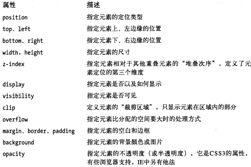

# 16 CSS脚本

## 16.1 CSS 概览
Example 16-1. Defining and using Cascading Style Sheets
```
<head>
<style type="text/css">
/* Specify that headings display in blue italic text. */
h1, h2 { color: blue; font-style: italic }
/*
 * Any element of class="WARNING" displays in big bold text with large margins
 * and a yellow background with a fat red border.
 */
.WARNING {
          font-weight: bold;
          font-size: 150%;
          margin: 0 1in 0 1in; /* top right bottom left */
          background-color: yellow;
          border: solid red 8px;
          padding: 10px;       /* 10 pixels on all 4 sides */
}
/*
 * Text within an h1 or h2 heading within an element with class="WARNING"
 * should be centered, in addition to appearing in blue italics.
 */
.WARNING h1, .WARNING h2 { text-align: center }
/* The single element with id="special" displays in centered uppercase. */
#special {
      text-align: center;
      text-transform: uppercase;
}
</style>
</head>
<body>
<h1>Cascading Style Sheets Demo</h1>
<div class="WARNING">
<h2>Warning</h2>
This is a warning!
Notice how it grabs your attention with its bold text and bright colors.
Also notice that the heading is centered and in blue italics.
</div>
<p id="special">
This paragraph is centered<br>
and appears in uppercase letters.<br>
<span style="text-transform: none">
Here we explicitly use an inline style to override the uppercase letters.
</span>
</p>
```

# 16.2 重要的CSS属性



